---
## Front matter
title: "Информационная безопасность"
subtitle: "Лабораторная работа №1"
author: "Матюшкин Денис Владимирович (НПИбд-02-21)"

## Generic otions
lang: ru-RU
toc-title: "Содержание"

## Bibliography
bibliography: bib/cite.bib
csl: pandoc/csl/gost-r-7-0-5-2008-numeric.csl

## Pdf output format
toc: true # Table of contents
toc-depth: 2
lof: true # List of figures
lot: true # List of tables
fontsize: 12pt
linestretch: 1.5
papersize: a4
documentclass: scrreprt
## I18n polyglossia
polyglossia-lang:
  name: russian
  options:
	- spelling=modern
	- babelshorthands=true
polyglossia-otherlangs:
  name: english
## I18n babel
babel-lang: russian
babel-otherlangs: english
## Fonts
mainfont: IBM Plex Serif
romanfont: IBM Plex Serif
sansfont: IBM Plex Sans
monofont: IBM Plex Mono
mathfont: STIX Two Math
mainfontoptions: Ligatures=Common,Ligatures=TeX,Scale=0.94
romanfontoptions: Ligatures=Common,Ligatures=TeX,Scale=0.94
sansfontoptions: Ligatures=Common,Ligatures=TeX,Scale=MatchLowercase,Scale=0.94
monofontoptions: Scale=MatchLowercase,Scale=0.94,FakeStretch=0.9
mathfontoptions:
## Biblatex
biblatex: true
biblio-style: "gost-numeric"
biblatexoptions:
  - parentracker=true
  - backend=biber
  - hyperref=auto
  - language=auto
  - autolang=other*
  - citestyle=gost-numeric
## Pandoc-crossref LaTeX customization
figureTitle: "Рис."
tableTitle: "Таблица"
listingTitle: "Листинг"
lofTitle: "Список иллюстраций"
lotTitle: "Список таблиц"
lolTitle: "Листинги"
## Misc options
indent: true
header-includes:
  - \usepackage{indentfirst}
  - \usepackage{float} # keep figures where there are in the text
  - \floatplacement{figure}{H} # keep figures where there are in the text
---

# Цель работы

Целью данной работы является приобретение практических навыков установки операционной системы на виртуальную машину, настройки минимально необходимых для дальнейшей работы сервисов.

# Теоретическое введение

VirtualBox (Oracle VM VirtualBox) — программный продукт виртуализации для операционных систем Windows, Linux, FreeBSD, macOS, Solaris/OpenSolaris, ReactOS, DOS и других [@virtualbox-doc:documentation].

Rocky Linux — дистрибутив Linux, разработанный Rocky Enterprise Software Foundation. Предполагается, что это будет полный бинарно-совместимый выпуск, использующий исходный код операционной системы Red Hat Enterprise Linux (RHEL) [@rocky-doc:documentation].

# Ход работы

1. Создайте новую виртуальную машину. Укажите имя виртуальной машины, тип операционной системы — Linux, RedHat (рис. [-@fig:001]).

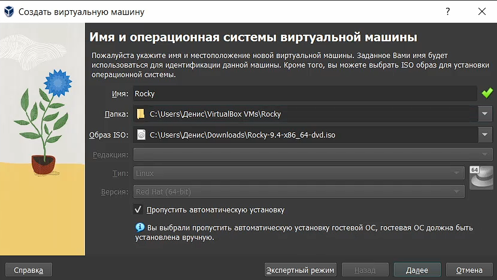{#fig:001 width=100%}

2. Укажите размер основной памяти виртуальной машины — 2048 МБ (или большее число, кратное 1024 МБ, если позволяют технические характеристики вашего компьютера) и количество виртуальных процессоро (рис. [-@fig:002]).

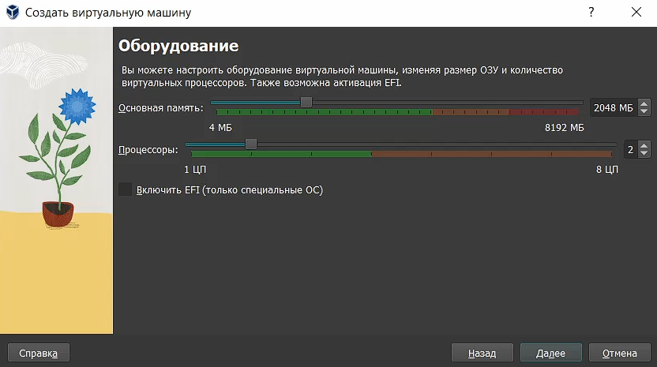{#fig:002 width=100%}

3. Задайте размер диска — 40 ГБ (или больше) (рис. [-@fig:003]).

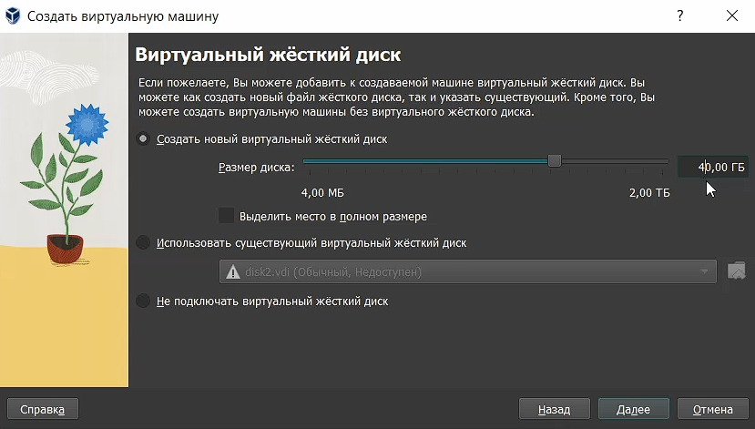{#fig:003 width=100%}

4. Создайте виртуальную машину (рис. [-@fig:004]).

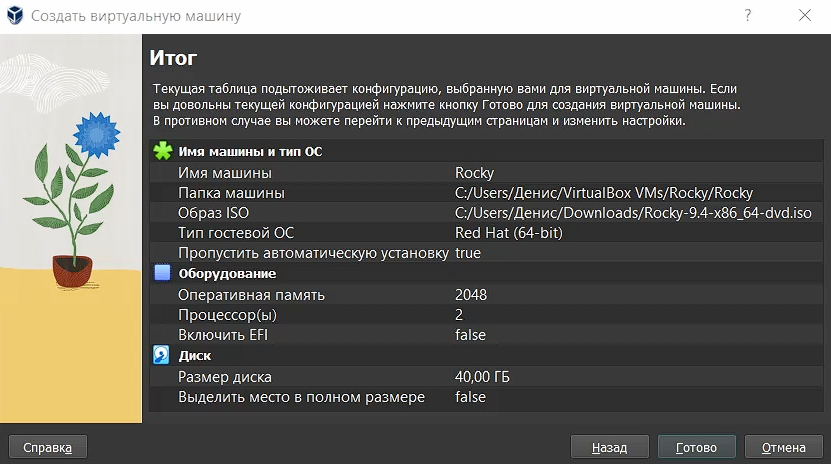{#fig:004 width=100%}

5. Запустите виртуальную машину, выберите English в качестве языка интерфейса и перейдите к настройкам установки операционной системы (рис. [-@fig:005]).

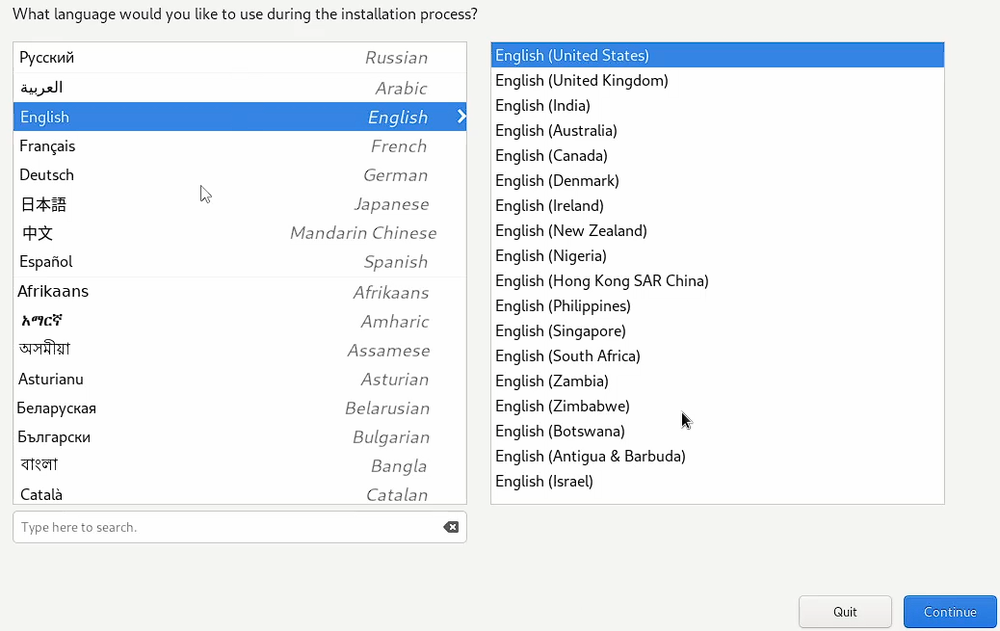{#fig:005 width=100%}

6. При необходимости скорректируйте часовой пояс, раскладку клавиатуры, рекомендуется добавить русский язык, но в качестве языка по умолчанию указать английский язык; задать комбинацию клавиш для переключения между раскладками клавиатуры (рис. [-@fig:006]).

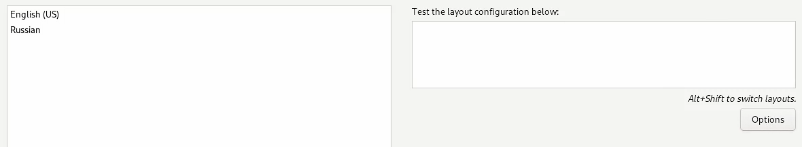{#fig:006 width=100%}

7. В разделе выбора программ укажите в качестве базового окружения Server with GUI , а в качестве дополнения — Development Tools (рис. [-@fig:007]).

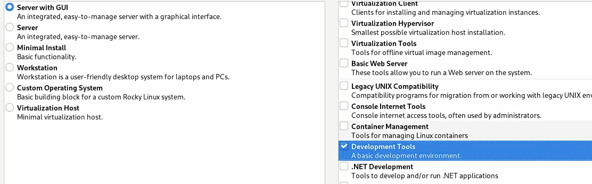{#fig:007 width=100%}

8. Отключите KDUMP (рис. [-@fig:008]).

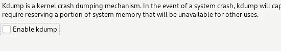{#fig:008 width=100%}

9. Включите сетевое соединение и в качестве имени узла укажите user.localdomain, где вместо user укажите имя своего пользователя в соответствии с соглашением об именовании (рис. [-@fig:009]).

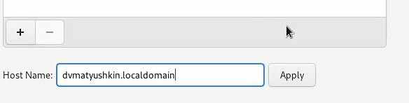{#fig:009 width=100%}

10. Установите пароль для root и пользователя с правами администратора (рис. [-@fig:010] и [-@fig:011]).

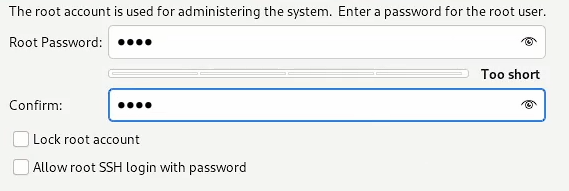{#fig:010 width=100%}

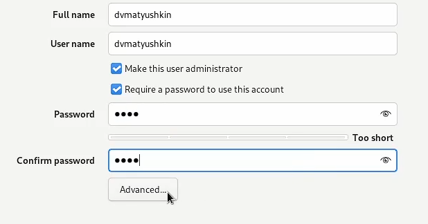{#fig:011 width=100%}

11. После завершения установки операционной системы корректно перезапустите виртуальную машину и примите условия лицензии.

12. В VirtualBox оптический диск должен отключиться автоматически, но если это не произошло, то необходимо отключить носитель информации с образом, выбрав Свойства Носители Rocky-версия-dvd1.iso Удалить устройство (рис. [-@fig:012]).

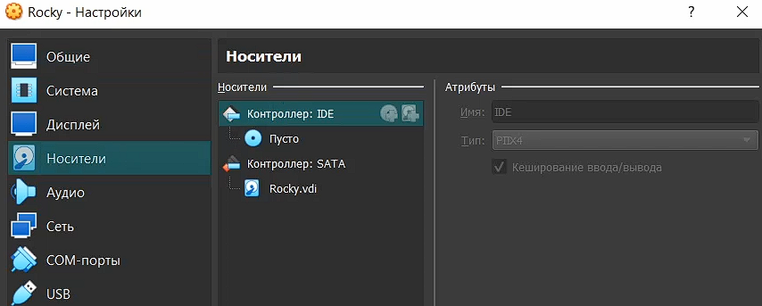{#fig:012 width=100%}

13. Войдите в ОС под заданной вами при установке учётной записью. В меню Устройства виртуальной машины подключите образ диска дополнений гостевой ОС, при необходимости введите пароль пользователя root вашей виртуальной ОС (рис. [-@fig:013] и [-@fig:014]).

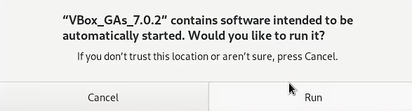{#fig:013 width=100%}

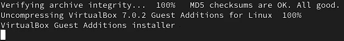{#fig:014 width=100%}

# Домашнее задание

Дождитесь загрузки графического окружения и откройте терминал. В окне терминала проанализируйте последовательность загрузки системы, выполнив команду dmesg. Можно просто просмотреть вывод этой команды (рис. [-@fig:015]):

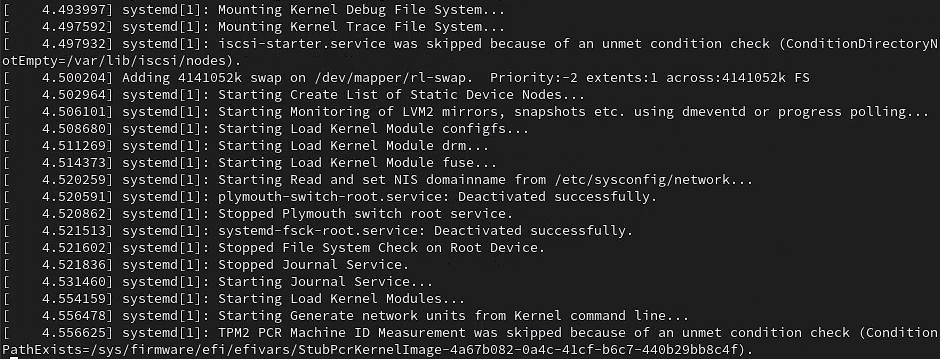{#fig:015 width=100%}

Получите следующую информацию:

1. Версия ядра Linux (Linux version).

Ответ: 5.14.0-427.33.1.el9_4.x86_64

2. Частота процессора (Detected Mhz processor).

Ответ: не вывел по какой-то причине.

3. Модель процессора (CPU0).

Ответ: AMD Ryzen 3 4300U with Radeon Graphics

4. Объем доступной оперативной памяти (Memory available).

Ответ: свободно – 3659, занято – 1258 (в мб)

5. Тип обнаруженного гипервизора (Hypervisor detected).

Ответ: KVM

6. Тип файловой системы корневого раздела.

Ответ: xfs

7. Последовательность монтирования файловых систем (рис. [-@fig:016]).

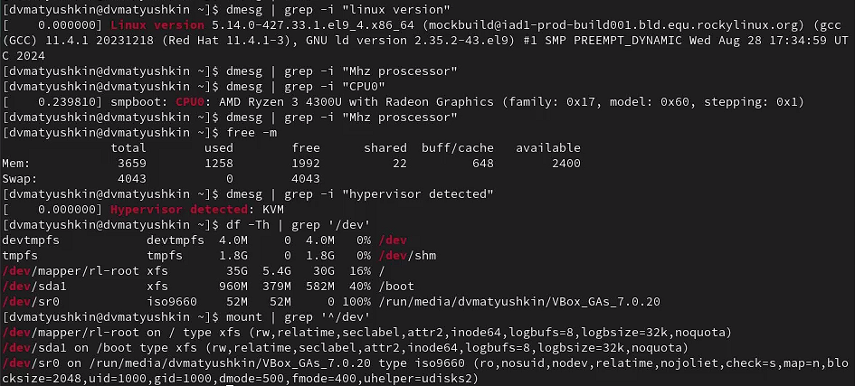{#fig:016 width=100%}

# Выводы

В ходе данной лабораторной работы мы приобрели практические навыки установки операционной системы на виртуальную машину, настроили минимально необходимые для дальнейшей работы сервисы.

# Контрольные вопросы

1. Какую информацию содержит учётная запись пользователя?

Системное имя, идентификатор пользователя, идентификатор группы, полное имя, домашний каталог, начальная оболочка.

2. Укажите команды терминала и приведите примеры: 

- для получения справки по команде - man <команда> . Например: man ls

- для перемещения по файловой системе - cd <каталог>. Например cd / (перемещение в корневой каталог)

- для просмотра содержимого каталога - ls <каталог_если_нужно>. Например ls / (содержимое корневого каталога)

- для определения объёма каталога - du -s <каталог>. Например du -s /etc

- для создания / удаления каталогов / файлов - rm <ключ> <название файла/каталога>. При этом пустые каталоги можно удалять командой rmdir, если добавить ключ -s то не только пустые. Любые файлы, можно удалять командой rm с ключом -r (рекурсивно). Например rm -r useless или rmdir -s useless. Для создание каталога использовать команду mkdir, для создания файла – touch. Например: mkdir cat; touch cat/mary.txt

- для задания определённых прав на файл / каталог - chmod <xxx> <имя>. Например: chmod 777 filename.txt

- для просмотра истории команд – history

3. Что такое файловая система? Приведите примеры с краткой характеристикой.

Порядок, определяющий способ организации, хранения и именования данных на носителях информации. Например ext2. Характеристика: ext2 журналируема (при сбоях можно восстановить данные). Максимальный размер файла 16гб-2гб. Максимальный размер тома 2гб-32гб. Существует единственный корневой каталог откуда исходят остальные каталоги. Максимальная длина имени файла 266 байт.

4. Как посмотреть, какие файловые системы подмонтированы в ОС? 

Ответ: Командой mount

5. Как удалить зависший процесс? 

Ответ: kill <PID>. PID можно получить командой ps axu | grep "то что мы ищем". Например:  kill 5099

# Список литературы{.unnumbered}

::: {#refs}
:::
