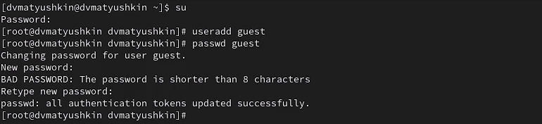
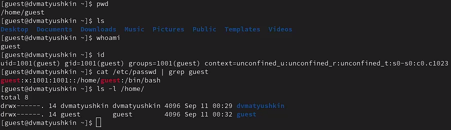
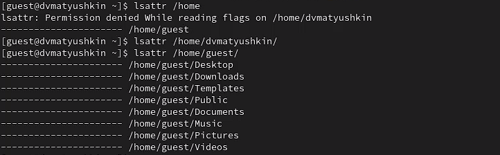

---
## Front matter
lang: ru-RU
title: Информационная безопасность
subtitle: Лабораторная работа №2
author:
  - Матюшкин Д. В.
institute:
  - Российский университет дружбы народов, Москва, Россия
date: 11 сентября 2024

## i18n babel
babel-lang: russian
babel-otherlangs: english

## Formatting pdf
toc: false
toc-title: Содержание
slide_level: 2
aspectratio: 169
section-titles: true
theme: metropolis
header-includes:
 - \metroset{progressbar=frametitle,sectionpage=progressbar,numbering=fraction}
 - '\makeatletter'
 - '\beamer@ignorenonframefalse'
 - '\makeatother'

## Pandoc-crossref LaTeX customization
figureTitle: "Рис."
---

# Информация

## Докладчик

:::::::::::::: {.columns align=center}
::: {.column width="70%"}

  * Матюшкин Денис Владимирович
  * студент 4-го курса
  * группа НПИбд-02-21
  * Российский университет дружбы народов
  * [1032212279@pfur.ru](mailto:1032212279@pfur.ru)
  * <https://stifell.github.io/ru/>

:::
::: {.column width="30%"}

:::
::::::::::::::

# Цель работы

- Получение практических навыков работы в консоли с атрибутами файлов, закрепление теоретических основ дискреционного разграничения доступа в современных системах с открытым кодом на базе ОС Linux.

# Выполнение лабораторной работы

## 1. Новый пользователь guest

{#fig:001 width=70%}

## 2. Вход под нового пользователя

{#fig:002 width=70%}

## 3. Работа с директориями и правами доступа

{#fig:003 width=70%}

## 4. Расширенные атрибуты в директории /home

{#fig:004 width=70%}

## 5. Работа с правами доступа директории dir1

{#fig:005 width=70%}

## 6. Заполнение таблицы «Установленные права и разрешённые действия»

| | | | | | | | | | |
|-|-|-|-|-|-|-|-|-|-|
|Права директории|Права  файла|Создание  файла|Удаление  файла|Запись  в файл|Чтение  файла|Смена  директории|Просмотр файлов в  директории|Переимено- вание файла|Смена  атрибутов  файла|
|d(000)|(000)| -| -| -| -| -| -| -| -|
|d(000)|(100)| -| -| -| -| -| -| -| -|
|d(000)|(200)| -| -| -| -| -| -| -| -|
|d(000)|(300)| -| -| -| -| -| -| -| -|
|d(000)|(400)| -| -| -| -| -| -| -| -|
|d(000)|(500)| -| -| -| -| -| -| -| -|
|d(000)|(600)| -| -| -| -| -| -| -| -|
|d(000)|(700)| -| -| -| -| -| -| -| -|
|d(100)|(000)| -| -| -| -|+| -| -|+|
|d(100)|(100)| -| -| -| -|+| -| -|+|
|d(100)|(200)| -| -|+| -|+| -| -|+|
|d(100)|(300)| -| -|+| -|+| -| -|+|
|d(100)|(400)| -| -|-|+|+| -| -|+|
|d(100)|(500)| -| -|-|+|+| -| -|+|
|d(100)|(600)| -| -|+|+|+| -| -|+|
|d(100)|(700)| -| -|+|+|+| -| -|+|
|d(200)|(000)| -| -|-|-|-| -| -|-|
|d(200)|(100)| -| -|-|-|-| -| -|-|
|d(200)|(200)| -| -|-|-|-| -| -|-|
|d(200)|(300)| -| -|-|-|-| -| -|-|
|d(200)|(400)| -| -|-|-|-| -| -|-|
|d(200)|(500)| -| -|-|-|-| -| -|-|
|d(200)|(600)| -| -|-|-|-| -| -|-|
|d(200)|(700)| -| -|-|-|-| -| -|-|
|d(300)|(000)|+|+|-|-|+| -|+|+|
|d(300)|(100)|+|+|-|-|+| -|+|+|
|d(300)|(200)|+|+|+|-|+| -|+|+|
|d(300)|(300)|+|+|+|-|+| -|+|+|
|d(300)|(400)|+|+|-|+|+| -|+|+|
|d(300)|(500)|+|+|-|+|+| -|+|+|
|d(300)|(600)|+|+|+|+|+| -|+|+|
|d(300)|(700)|+|+|+|+|+| -|+|+|
|d(400)|(000)|-|-|-|-|-|+|-|-|
|d(400)|(100)|-|-|-|-|-|+|-|-|
|d(400)|(200)|-|-|-|-|-|+|-|-|
|d(400)|(300)|-|-|-|-|-|+|-|-|
|d(400)|(400)|-|-|-|-|-|+|-|-|
|d(400)|(500)|-|-|-|-|-|+|-|-|
|d(400)|(600)|-|-|-|-|-|+|-|-|
|d(400)|(700)|-|-|-|-|-|+|-|-|
|d(500)|(000)|-|-|-|-|+|+|-|+|
|d(500)|(100)|-|-|-|-|+|+|-|+|
|d(500)|(200)|-|-|+|-|+|+|-|+|
|d(500)|(300)|-|-|+|-|+|+|-|+|
|d(500)|(400)|-|-|-|+|+|+|-|+|
|d(500)|(500)|-|-|-|+|+|+|-|+|
|d(500)|(600)|-|-|+|+|+|+|-|+|
|d(500)|(700)|-|-|+|+|+|+|-|+|
|d(600)|(000)|-|-|-|-|-|+|-|-|
|d(600)|(100)|-|-|-|-|-|+|-|-|
|d(600)|(200)|-|-|-|-|-|+|-|-|
|d(600)|(300)|-|-|-|-|-|+|-|-|
|d(600)|(400)|-|-|-|-|-|+|-|-|
|d(600)|(500)|-|-|-|-|-|+|-|-|
|d(600)|(600)|-|-|-|-|-|+|-|-|
|d(600)|(700)|-|-|-|-|-|+|-|-|
|d(700)|(000)|+|+|-|-|+|+|+|+|
|d(700)|(100)|+|+|-|-|+|+|+|+|
|d(700)|(200)|+|+|+|-|+|+|+|+|
|d(700)|(300)|+|+|+|-|+|+|+|+|
|d(700)|(400)|+|+|-|+|+|+|+|+|
|d(700)|(500)|+|+|-|+|+|+|+|+|
|d(700)|(600)|+|+|+|+|+|+|+|+|
|d(700)|(700)|+|+|+|+|+|+|+|+|

## 7. Минимально необходимые права для выполнения операций

| | | | | |
|-|-|-|-|-|
|Операция| |Минимальные  права на  директорию| |Минимальные  права на файл|
|Создание файла| |d(300)| |(000)|
|Удаление файла| |d(300)| |(000)|
|Чтение файла| |d(100)| |(400)|
|Запись в файл| |d(100)| |(200)|
|Переименование файла| |d(300)| |(000)|
|Создание поддиректории| |d(300)| |(000)|
|Удаление поддиректории| |d(300)| |(000)|

# Выводы

В ходе данной лабораторной работы мы приобрели практические навыки установки операционной системы на виртуальную машину, настроили минимально необходимые для дальнейшей работы сервисы.