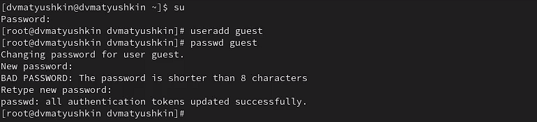
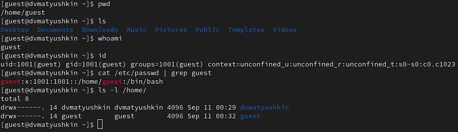
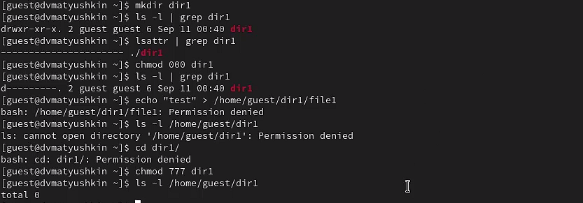

---
## Front matter
title: "Информационная безопасность"
subtitle: "Лабораторная работа №2"
author: "Матюшкин Денис Владимирович (НПИбд-02-21)"

## Generic otions
lang: ru-RU
toc-title: "Содержание"

## Bibliography
bibliography: bib/cite.bib
csl: pandoc/csl/gost-r-7-0-5-2008-numeric.csl

## Pdf output format
toc: true # Table of contents
toc-depth: 2
lof: true # List of figures
lot: true # List of tables
fontsize: 12pt
linestretch: 1.5
papersize: a4
documentclass: scrreprt
## I18n polyglossia
polyglossia-lang:
  name: russian
  options:
	- spelling=modern
	- babelshorthands=true
polyglossia-otherlangs:
  name: english
## I18n babel
babel-lang: russian
babel-otherlangs: english
## Fonts
mainfont: IBM Plex Serif
romanfont: IBM Plex Serif
sansfont: IBM Plex Sans
monofont: IBM Plex Mono
mathfont: STIX Two Math
mainfontoptions: Ligatures=Common,Ligatures=TeX,Scale=0.94
romanfontoptions: Ligatures=Common,Ligatures=TeX,Scale=0.94
sansfontoptions: Ligatures=Common,Ligatures=TeX,Scale=MatchLowercase,Scale=0.94
monofontoptions: Scale=MatchLowercase,Scale=0.94,FakeStretch=0.9
mathfontoptions:
## Biblatex
biblatex: true
biblio-style: "gost-numeric"
biblatexoptions:
  - parentracker=true
  - backend=biber
  - hyperref=auto
  - language=auto
  - autolang=other*
  - citestyle=gost-numeric
## Pandoc-crossref LaTeX customization
figureTitle: "Рис."
tableTitle: "Таблица"
listingTitle: "Листинг"
lofTitle: "Список иллюстраций"
lotTitle: "Список таблиц"
lolTitle: "Листинги"
## Misc options
indent: true
header-includes:
  - \usepackage{indentfirst}
  - \usepackage{float} # keep figures where there are in the text
  - \floatplacement{figure}{H} # keep figures where there are in the text
---

# Цель работы

Получение практических навыков работы в консоли с атрибутами файлов, закрепление теоретических основ дискреционного разграничения доступа в современных системах с открытым кодом на базе ОС Linux.

# Теоретическое введение

VirtualBox (Oracle VM VirtualBox) — программный продукт виртуализации для операционных систем Windows, Linux, FreeBSD, macOS, Solaris/OpenSolaris, ReactOS, DOS и других [@virtualbox-doc:documentation].

Rocky Linux — дистрибутив Linux, разработанный Rocky Enterprise Software Foundation. Предполагается, что это будет полный бинарно-совместимый выпуск, использующий исходный код операционной системы Red Hat Enterprise Linux (RHEL) [@rocky-doc:documentation].

# Ход работы

1. В установленной при выполнении предыдущей лабораторной работы операционной системе создайте учётную запись пользователя guest (использую учётную запись администратора) (рис. [-@fig:001]).

2. Задайте пароль для пользователя guest (использую учётную запись администратора) (рис. [-@fig:001]).

{#fig:001 width=100%}

3. Войдите в систему от имени пользователя guest (рис. [-@fig:002]).

{#fig:002 width=100%}

4. Определите директорию, в которой вы находитесь, командой pwd. Сравните её с приглашением командной строки. Определите, является ли она вашей домашней директорией? Если нет, зайдите в домашнюю директорию (рис. [-@fig:003]).

5. Уточните имя вашего пользователя командой whoami (рис. [-@fig:003]).

6. Уточните имя вашего пользователя, его группу, а также группы, куда входит пользователь, командой id. Выведенные значения uid, gid и др. запомните. Сравните вывод id с выводом команды groups (рис. [-@fig:003]).

7. Просмотрите файл /etc/passwd. Найдите в нём свою учётную запись. Определите uid пользователя. Определите gid пользователя. Сравните найденные значения с полученными в предыдущих пунктах (рис. [-@fig:003]).

8. Определите существующие в системе директории (рис. [-@fig:003]). Получить список поддиректорий удалось, права доступа: владелец - r (чтение), w (запись), x (выполнение); группа - отсутсвует; остальные - отсутсвует.

{#fig:003 width=100%}

9. Проверьте, какие расширенные атрибуты установлены на поддиректориях, находящихся в директории /home (рис. [-@fig:004]). Удалось посмотреть атрибуты только у guest.

{#fig:004 width=100%}

10. Создайте в домашней директории поддиректорию dir1. Определите командами ls -l и lsattr, какие права доступа и расширенные атрибуты были выставлены на директорию dir1 (рис. [-@fig:005]).Пправа доступа: владелец - r (чтение), w (запись), x (выполнение); группа - r (чтение), x (выполнение); остальные - r (чтение), x (выполнение).

11. Снимите с директории dir1 все атрибуты. Проверьте с её помощью правильность выполнения команды (рис. [-@fig:005]).

12. Попытайтесь создать в директории dir1 файл file1 (рис. [-@fig:005]). Получили отказ, т.к. нам не достает прав на создание файла.

{#fig:005 width=100%}

13. Заполните таблицу «Установленные права и разрешённые действия» (см. табл. [-@tbl:privilege]), выполняя действия от имени владельца директории (файлов), определив опытным путём, какие операции разрешены, а какие нет. Если операция разрешена, занесите в таблицу знак «+», если не разрешена, знак «-».

: Установленные права и разрешённые действия {#tbl:privilege}

| | | | | | | | | | |
|-|-|-|-|-|-|-|-|-|-|
|Права директории|Права  файла|Создание  файла|Удаление  файла|Запись  в файл|Чтение  файла|Смена  директории|Просмотр файлов в  директории|Переимено- вание файла|Смена  атрибутов  файла|
|d(000)|(000)| -| -| -| -| -| -| -| -|
|d(000)|(100)| -| -| -| -| -| -| -| -|
|d(000)|(200)| -| -| -| -| -| -| -| -|
|d(000)|(300)| -| -| -| -| -| -| -| -|
|d(000)|(400)| -| -| -| -| -| -| -| -|
|d(000)|(500)| -| -| -| -| -| -| -| -|
|d(000)|(600)| -| -| -| -| -| -| -| -|
|d(000)|(700)| -| -| -| -| -| -| -| -|
|d(100)|(000)| -| -| -| -|+| -| -|+|
|d(100)|(100)| -| -| -| -|+| -| -|+|
|d(100)|(200)| -| -|+| -|+| -| -|+|
|d(100)|(300)| -| -|+| -|+| -| -|+|
|d(100)|(400)| -| -|-|+|+| -| -|+|
|d(100)|(500)| -| -|-|+|+| -| -|+|
|d(100)|(600)| -| -|+|+|+| -| -|+|
|d(100)|(700)| -| -|+|+|+| -| -|+|
|d(200)|(000)| -| -|-|-|-| -| -|-|
|d(200)|(100)| -| -|-|-|-| -| -|-|
|d(200)|(200)| -| -|-|-|-| -| -|-|
|d(200)|(300)| -| -|-|-|-| -| -|-|
|d(200)|(400)| -| -|-|-|-| -| -|-|
|d(200)|(500)| -| -|-|-|-| -| -|-|
|d(200)|(600)| -| -|-|-|-| -| -|-|
|d(200)|(700)| -| -|-|-|-| -| -|-|
|d(300)|(000)|+|+|-|-|+| -|+|+|
|d(300)|(100)|+|+|-|-|+| -|+|+|
|d(300)|(200)|+|+|+|-|+| -|+|+|
|d(300)|(300)|+|+|+|-|+| -|+|+|
|d(300)|(400)|+|+|-|+|+| -|+|+|
|d(300)|(500)|+|+|-|+|+| -|+|+|
|d(300)|(600)|+|+|+|+|+| -|+|+|
|d(300)|(700)|+|+|+|+|+| -|+|+|
|d(400)|(000)|-|-|-|-|-|+|-|-|
|d(400)|(100)|-|-|-|-|-|+|-|-|
|d(400)|(200)|-|-|-|-|-|+|-|-|
|d(400)|(300)|-|-|-|-|-|+|-|-|
|d(400)|(400)|-|-|-|-|-|+|-|-|
|d(400)|(500)|-|-|-|-|-|+|-|-|
|d(400)|(600)|-|-|-|-|-|+|-|-|
|d(400)|(700)|-|-|-|-|-|+|-|-|
|d(500)|(000)|-|-|-|-|+|+|-|+|
|d(500)|(100)|-|-|-|-|+|+|-|+|
|d(500)|(200)|-|-|+|-|+|+|-|+|
|d(500)|(300)|-|-|+|-|+|+|-|+|
|d(500)|(400)|-|-|-|+|+|+|-|+|
|d(500)|(500)|-|-|-|+|+|+|-|+|
|d(500)|(600)|-|-|+|+|+|+|-|+|
|d(500)|(700)|-|-|+|+|+|+|-|+|
|d(600)|(000)|-|-|-|-|-|+|-|-|
|d(600)|(100)|-|-|-|-|-|+|-|-|
|d(600)|(200)|-|-|-|-|-|+|-|-|
|d(600)|(300)|-|-|-|-|-|+|-|-|
|d(600)|(400)|-|-|-|-|-|+|-|-|
|d(600)|(500)|-|-|-|-|-|+|-|-|
|d(600)|(600)|-|-|-|-|-|+|-|-|
|d(600)|(700)|-|-|-|-|-|+|-|-|
|d(700)|(000)|+|+|-|-|+|+|+|+|
|d(700)|(100)|+|+|-|-|+|+|+|+|
|d(700)|(200)|+|+|+|-|+|+|+|+|
|d(700)|(300)|+|+|+|-|+|+|+|+|
|d(700)|(400)|+|+|-|+|+|+|+|+|
|d(700)|(500)|+|+|-|+|+|+|+|+|
|d(700)|(600)|+|+|+|+|+|+|+|+|
|d(700)|(700)|+|+|+|+|+|+|+|+|

14. На основании заполненной таблицы определите те или иные минимально необходимые права для выполнения операций внутри директории
dir1, заполните табл. [-@tbl:minimal].

: Минимальные права для совершения операций {#tbl:minimal}

| | | | | |
|-|-|-|-|-|
|Операция| |Минимальные  права на  директорию| |Минимальные  права на файл|
|Создание файла| |d(300)| |(000)|
|Удаление файла| |d(300)| |(000)|
|Чтение файла| |d(100)| |(400)|
|Запись в файл| |d(100)| |(200)|
|Переименование файла| |d(300)| |(000)|
|Создание поддиректории| |d(300)| |(000)|
|Удаление поддиректории| |d(300)| |(000)|

# Выводы

В ходе данной лабораторной работы мы получили практические навыки работы в консоли с атрибутами файлов, закрепили теоретические основы дискреционного разграничения доступа в современных системах с открытым кодом на базе ОС Linux.

# Список литературы{.unnumbered}

::: {#refs}
:::
