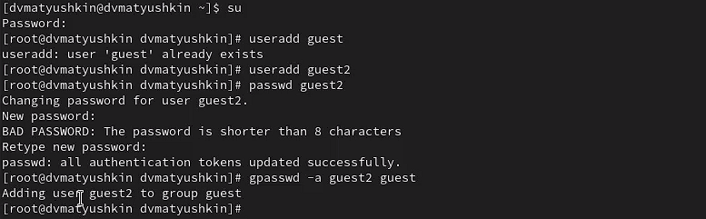
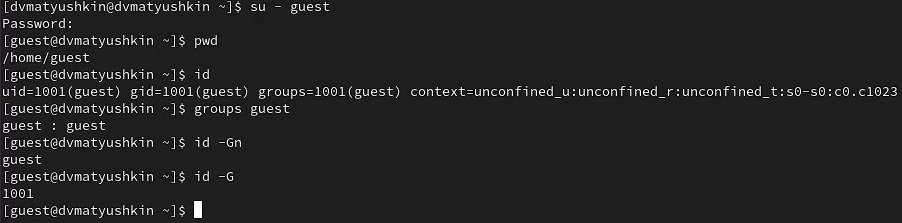
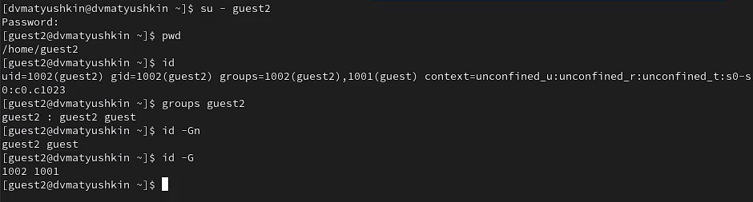
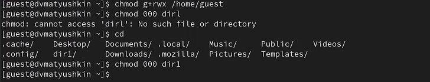
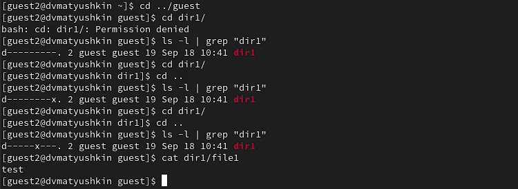

---
## Front matter
lang: ru-RU
title: Информационная безопасность
subtitle: Лабораторная работа №3
author:
  - Матюшкин Д. В.
institute:
  - Российский университет дружбы народов, Москва, Россия
date: 18 сентября 2024

## i18n babel
babel-lang: russian
babel-otherlangs: english

## Formatting pdf
toc: false
toc-title: Содержание
slide_level: 2
aspectratio: 169
section-titles: true
theme: metropolis
header-includes:
 - \metroset{progressbar=frametitle,sectionpage=progressbar,numbering=fraction}
 - '\makeatletter'
 - '\beamer@ignorenonframefalse'
 - '\makeatother'

## Pandoc-crossref LaTeX customization
figureTitle: "Рис."
---

# Информация

## Докладчик

:::::::::::::: {.columns align=center}
::: {.column width="70%"}

  * Матюшкин Денис Владимирович
  * студент 4-го курса
  * группа НПИбд-02-21
  * Российский университет дружбы народов
  * [1032212279@pfur.ru](mailto:1032212279@pfur.ru)
  * <https://stifell.github.io/ru/>

:::
::: {.column width="30%"}


:::
::::::::::::::

# Цель работы

- Получение практических навыков работы в консоли с атрибутами файлов для групп пользователей.

# Выполнение лабораторной работы

## 1. Новый пользователь guest2

{#fig:001 width=70%}

## 2.1. Вход под новых пользователей

Уточните имя вашего пользователя, его группу, кто входит в неё и к каким группам принадлежит он сам (рис. [-@fig:002] и [-@fig:003]).

{#fig:002 width=60%}

## 2.1. Продолжение

{#fig:003 width=70%}

## 3. Содержимое файла /etc/group

{#fig:004 width=70%}

## 4. Регистрация пользователя guest2 в группе guest

{#fig:005 width=70%}

## 5. Работа с правами доступа директорий dir1 и guest

{#fig:006 width=70%}

## 6. Заполнение таблицы «Установленные права и разрешённые действия для групп»

|   Права директории   |      Права файла     | Создание файла| Удаление файла | Запись в файл | Чтение файла | Смена директории | Просмотр файлов в директории | Переименование файл | Смена атрибутов файла |
|:---------------------|:---------------------|-----|-----|-----|-----|-----|-----|-----|-----|
|```d--------- (000)```|```---------- (000)```|  -	|  -  |  -  |  -  |  -	|  -  |  -  |  -  |
|```d-----x--- (010)```|```---------- (000)```|  -	|  -  |	 -	|  -  |  +  |  -  |  -  |  +  |
|```d----w---- (020)```|```---------- (000)```|  -	|  -  |	 -  |  -  |  -	|  -  |  -  |  -  |
|```d----wx--- (030)```|```---------- (000)```|  +	|  +  |  -	|  -  |  +  |  -  |  +  |  +  |
|```d---r----- (040)```|```---------- (000)```|  -	|  -  |	 -  |  -  |  -	|  +  |  -  |  -  |
|```d---r-x--- (050)```|```---------- (000)```|  -	|  -  |  -	|  -  |  +  |  +  |  -  |  +  |
|```d---rw---- (060)```|```---------- (000)```|  -	|  -  |  -  |  -  |  -	|  +  |  -  |  -  |
|```d---rwx--- (070)```|```---------- (000)```|  +	|  +  |	 -	|  -  |  +	|  +  |  +  |  +  |
|```d--------- (000)```|```------x--- (010)```|  -	|  -  |  -  |  -  |  -	|  -  |  -  |  -  |
|```d-----x--- (010)```|```------x--- (010)```|  -  |  -  |	 -	|  -  |  +	|  -  |  -  |  +  |
|```d----w---- (020)```|```------x--- (010)```|  -	|  -  |  -  |  -  |  -	|  -  |  -  |  -  |
|```d----wx--- (030)```|```------x--- (010)```|  +	|  +  |	 -	|  -  |  +	|  -  |  +  |  +  |
|```d---r----- (040)```|```------x--- (010)```|  -	|  -  |  -  |  -  |  -	|  +  |  -  |  -  |
|```d---r-x--- (050)```|```------x--- (010)```|  -	|  -  |	 -	|  -  |  +	|  +  |  -  |  +  |
|```d---rw---- (060)```|```------x--- (010)```|  -	|  -  |  -  |  -  |  -	|  +  |  -  |  -  |
|```d---rwx--- (070)```|```------x--- (010)```|  +	|  +  |	 -	|  -  |  +	|  +  |  +  |  +  |
|```d--------- (000)```|```-----w---- (020)```|  -	|  -  |  -  |  -  |  -	|  -  |  -  |  -  |
|```d-----x--- (010)```|```-----w---- (020)```|  -	|  -  |	 +	|  -  |  +	|  -  |  -  |  +  |
|```d----w---- (020)```|```-----w---- (020)```|  -	|  -  |  -  |  -  |  -	|  -  |  -  |  -  |
|```d----wx--- (030)```|```-----w---- (020)```|  +	|  +  |	 +	|  -  |  +	|  -  |  +  |  +  |
|```d---r----- (040)```|```-----w---- (020)```|  -	|  -  |  -  |  -  |  -	|  +  |  -  |  -  |
|```d---r-x--- (050)```|```-----w---- (020)```|  -	|  -  |	 +  |  -  |  +	|  +  |  -  |  +  |
|```d---rw---- (060)```|```-----w---- (020)```|  -	|  -  |  -  |  -  |  -	|  +  |  -  |  -  |
|```d---rwx--- (070)```|```-----w---- (020)```|  +	|  +  |	 +	|  -  |  +	|  +  |  +  |  +  |
|```d--------- (000)```|```-----wx--- (030)```|  -	|  -  |  -  |  -  |  -	|  -  |  -  |  -  |
|```d-----x--- (010)```|```-----wx--- (030)```|  -	|  -  |	 +	|  -  |  +	|  -  |  -  |  +  |
|```d----w---- (020)```|```-----wx--- (030)```|  -	|  -  |  -  |  -  |  -	|  -  |  -  |  -  |
|```d----wx--- (030)```|```-----wx--- (030)```|  +  |  +  |	 +  |  -  |  +  |  -  |  +  |  +  |
|```d---r----- (040)```|```-----wx--- (030)```|  -	|  -  |  -  |  -  |  -	|  +  |  -  |  -  |
|```d---r-x--- (050)```|```-----wx--- (030)```|  -  |  -  |	 +	|  -  |  +	|  +  |  -  |  +  |
|```d---rw---- (060)```|```-----wx--- (030)```|  -	|  -  |  -  |  -  |  -	|  +  |  -  |  -  |
|```d---rwx--- (070)```|```-----wx--- (030)```|  +	|  +  |	 +	|  -  |  +	|  +  |  +  |  +  |
|```d--------- (000)```|```----r----- (040)```|  -	|  -  |  -  |  -  |  -	|  -  |  -  |  -  |
|```d-----x--- (010)```|```----r----- (040)```|  -	|  -  |	 -	|  +  |  +	|  -  |  -  |  +  |
|```d----w---- (020)```|```----r----- (040)```|  -	|  -  |  -  |  -  |  -	|  -  |  -  |  -  |
|```d----wx--- (030)```|```----r----- (040)```|  +	|  +  |	 -	|  +  |  +	|  -  |  +  |  +  |
|```d---r----- (040)```|```----r----- (040)```|  -	|  -  |  -  |  -  |  -	|  +  |  -  |  -  |
|```d---r-x--- (050)```|```----r----- (040)```|  -  |  -  |	 -	|  +  |  +  |  +  |  -  |  +  |
|```d---rw---- (060)```|```----r----- (040)```|  -	|  -  |  -  |  -  |  -	|  +  |  -  |  -  |
|```d---rwx--- (070)```|```----r----- (040)```|  +	|  +  |	 -	|  +  |  +	|  +  |  +  |  +  |
|```d--------- (000)```|```----r-x--- (050)```|  -	|  -  |  -  |  -  |  -	|  -  |  -  |  -  |
|```d-----x--- (010)```|```----r-x--- (050)```|  -	|  -  |	 -	|  +  |  +	|  -  |  -  |  +  |
|```d----w---- (020)```|```----r-x--- (050)```|  -	|  -  |  -  |  -  |  -	|  -  |  -  |  -  |
|```d----wx--- (030)```|```----r-x--- (050)```|  +	|  +  |	 -  |  +  |  +	|  -  |  +  |  +  |
|```d---r----- (040)```|```----r-x--- (050)```|  -	|  -  |  -  |  -  |  -	|  +  |  -  |  -  |
|```d---r-x--- (050)```|```----r-x--- (050)```|  -	|  -  |	 -	|  +  |  +	|  +  |  -  |  +  |
|```d---rw---- (060)```|```----r-x--- (050)```|  -	|  -  |  -  |  -  |  -	|  +  |  -  |  -  |
|```d---rwx--- (070)```|```----r-x--- (050)```|  +	|  +  |	 -	|  +  |  +	|  +  |  +  |  +  |
|```d--------- (000)```|```----rw---- (060)```|  -	|  -  |  -  |  -  |  -	|  -  |  -  |  -  |
|```d-----x--- (010)```|```----rw---- (060)```|  -	|  -  |  +	|  +  |  +	|  -  |  -  |  +  |
|```d----w---- (020)```|```----rw---- (060)```|  -	|  -  |  -  |  -  |  -	|  -  |  -  |  -  |
|```d----wx--- (030)```|```----rw---- (060)```|  +	|  +  |	 +	|  +  |  +	|  -  |  +  |  +  |
|```d---r----- (040)```|```----rw---- (060)```|  -	|  -  |  -  |  -  |  -	|  +  |  -  |  -  |
|```d---r-x--- (050)```|```----rw---- (060)```|  -  |  -  |	 +	|  +  |  +	|  +  |  -  |  +  |
|```d---rw---- (060)```|```----rw---- (060)```|  -	|  -  |  -  |  -  |  -	|  +  |  -  |  -  |
|```d---rwx--- (070)```|```----rw---- (060)```|  +  |  +  |	 +	|  +  |  +	|  +  |  +  |  +  |
|```d--------- (000)```|```----rwx--- (070)```|  -	|  -  |  -  |  -  |  -	|  -  |  -  |  -  |
|```d-----x--- (010)```|```----rwx--- (070)```|  -  |  -  |	 +	|  +  |  +	|  -  |  -  |  +  |
|```d----w---- (020)```|```----rwx--- (070)```|  -	|  -  |  -  |  -  |  -	|  -  |  -  |  -  |
|```d----wx--- (030)```|```----rwx--- (070)```|  +  |  +  |	 +	|  +  |  +	|  -  |  +  |  +  |
|```d---r----- (040)```|```----rwx--- (070)```|  -	|  -  |  -  |  -  |  -	|  +  |  -  |  -  |
|```d---r-x--- (050)```|```----rwx--- (070)```|  -  |  -  |	 +	|  +  |  +	|  +  |  -  |  +  |
|```d---rw---- (060)```|```----rwx--- (070)```|  -	|  -  |  -  |  -  |  -	|  +  |  -  |  -  |
|```d---rwx--- (070)```|```----rwx--- (070)```|  +  |  +  |	 +	|  +  |  +	|  +  |  +  |  +  |

## 7. Минимальные права для совершения операций для групп

|        Операция        | Права на директорию | Права на файл |
|------------------------|---------------------------------|---------------------------|
|     Создание файла     |           ```d----wx--- (030)```      |      ```---------- (000)```     |	    
|     Удаление файла     |           ```d----wx--- (030)```      |      ```---------- (000)```     |
|      Чтение файла      |           ```d-----x--- (010)```      |      ```----r----- (040)```     |
|      Запись в файл     |           ```d-----x--- (010)```      |      ```-----w---- (020)```     |
|  Переименование файла  |           ```d----wx--- (030)```      |      ```---------- (000)```     |
| Создание поддиректории |           ```d----wx--- (030)```      |      ```---------- (000)```     |
| Удаление поддиректории |           ```d----wx--- (030)```      |      ```---------- (000)```     |

## 8.1. Данные для таблицы

{#fig:007 width=70%}

## 8.2. Продолжение

{#fig:008 width=70%}


# Выводы

В ходе данной лабораторной работы мы получили практические навыки работы в консоли с атрибутами файлов для групп пользователей.