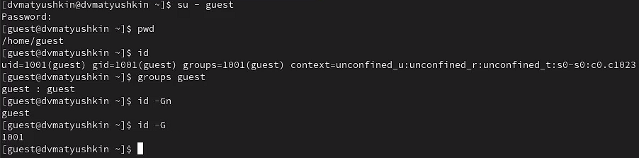
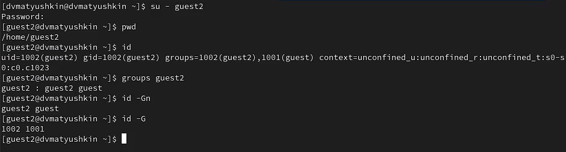
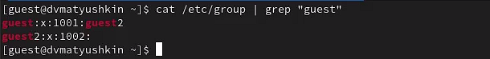
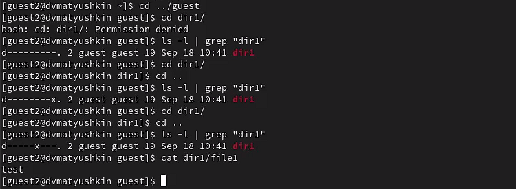

---
## Front matter
title: "Информационная безопасность"
subtitle: "Лабораторная работа №3"
author: "Матюшкин Денис Владимирович (НПИбд-02-21)"

## Generic otions
lang: ru-RU
toc-title: "Содержание"

## Bibliography
bibliography: bib/cite.bib
csl: pandoc/csl/gost-r-7-0-5-2008-numeric.csl

## Pdf output format
toc: true # Table of contents
toc-depth: 2
lof: true # List of figures
lot: true # List of tables
fontsize: 12pt
linestretch: 1.5
papersize: a4
documentclass: scrreprt
## I18n polyglossia
polyglossia-lang:
  name: russian
  options:
	- spelling=modern
	- babelshorthands=true
polyglossia-otherlangs:
  name: english
## I18n babel
babel-lang: russian
babel-otherlangs: english
## Fonts
mainfont: IBM Plex Serif
romanfont: IBM Plex Serif
sansfont: IBM Plex Sans
monofont: IBM Plex Mono
mathfont: STIX Two Math
mainfontoptions: Ligatures=Common,Ligatures=TeX,Scale=0.94
romanfontoptions: Ligatures=Common,Ligatures=TeX,Scale=0.94
sansfontoptions: Ligatures=Common,Ligatures=TeX,Scale=MatchLowercase,Scale=0.94
monofontoptions: Scale=MatchLowercase,Scale=0.94,FakeStretch=0.9
mathfontoptions:
## Biblatex
biblatex: true
biblio-style: "gost-numeric"
biblatexoptions:
  - parentracker=true
  - backend=biber
  - hyperref=auto
  - language=auto
  - autolang=other*
  - citestyle=gost-numeric
## Pandoc-crossref LaTeX customization
figureTitle: "Рис."
tableTitle: "Таблица"
listingTitle: "Листинг"
lofTitle: "Список иллюстраций"
lotTitle: "Список таблиц"
lolTitle: "Листинги"
## Misc options
indent: true
header-includes:
  - \usepackage{indentfirst}
  - \usepackage{float} # keep figures where there are in the text
  - \floatplacement{figure}{H} # keep figures where there are in the text
---

# Цель работы

Получение практических навыков работы в консоли с атрибутами файлов для групп пользователей.

# Теоретическое введение

VirtualBox (Oracle VM VirtualBox) — программный продукт виртуализации для операционных систем Windows, Linux, FreeBSD, macOS, Solaris/OpenSolaris, ReactOS, DOS и других [@virtualbox-doc:documentation].

Rocky Linux — дистрибутив Linux, разработанный Rocky Enterprise Software Foundation. Предполагается, что это будет полный бинарно-совместимый выпуск, использующий исходный код операционной системы Red Hat Enterprise Linux (RHEL) [@rocky-doc:documentation].

# Ход работы

1. В установленной при выполнении предыдущей лабораторной работы операционной системе создайте учётную запись пользователя guest (использую учётную запись администратора) (рис. [-@fig:001]).

2. Задайте пароль для пользователя guest (использую учётную запись администратора) (рис. [-@fig:001]).

3. Аналогично создайте второго пользователя guest2 (рис. [-@fig:001]).

4. Добавьте пользователя guest2 в группу guest (рис. [-@fig:001]).

{#fig:001 width=100%}

5. Осуществите вход в систему от двух пользователей на двух разных консолях: guest на первой консоли и guest2 на второй консоли.

6. Для обоих пользователей командой pwd определите директорию, в которой вы находитесь. Сравните её с приглашениями командной строки (рис. [-@fig:002] и [-@fig:003]).

7.Уточните имя вашего пользователя, его группу, кто входит в неё и к каким группам принадлежит он сам. Определите командами groups guest и groups guest2, в какие группы входят пользователи guest и guest2. Сравните вывод команды groups с выводом команд id -Gn и id -G (рис. [-@fig:002] и [-@fig:003]).

{#fig:002 width=100%}

{#fig:003 width=100%}

8. Сравните полученную информацию с содержимым файла /etc/group (рис. [-@fig:004]).

{#fig:004 width=100%}

9. От имени пользователя guest2 выполните регистрацию пользователя
guest2 в группе guest (рис. [-@fig:005]).

{#fig:005 width=100%}

10. От имени пользователя guest измените права директории /home/guest,
разрешив все действия для пользователей группы (рис. [-@fig:006]).

11. От имени пользователя guest снимите с директории /home/guest/dir1
все атрибуты (рис. [-@fig:006]).

{#fig:006 width=100%}

12. Заполните таблицу «Установленные права и разрешённые действия» (см. табл. [-@tbl:privilege]), выполняя действия от имени владельца директории (файлов), определив опытным путём, какие операции разрешены, а какие нет. Если операция разрешена, занесите в таблицу знак «+», если не разрешена, знак «-» (рис. [-@fig:007] и [-@fig:008]).

: Установленные права и разрешённые действия для групп {#tbl:privilege}

|   Права директории   |      Права файла     | Создание файла| Удаление файла | Запись в файл | Чтение файла | Смена директории | Просмотр файлов в директории | Переименование файл | Смена атрибутов файла |
|:---------------------|:---------------------|-----|-----|-----|-----|-----|-----|-----|-----|
|```d--------- (000)```|```---------- (000)```|  -	|  -  |  -  |  -  |  -	|  -  |  -  |  -  |
|```d-----x--- (010)```|```---------- (000)```|  -	|  -  |	 -	|  -  |  +  |  -  |  -  |  +  |
|```d----w---- (020)```|```---------- (000)```|  -	|  -  |	 -  |  -  |  -	|  -  |  -  |  -  |
|```d----wx--- (030)```|```---------- (000)```|  +	|  +  |  -	|  -  |  +  |  -  |  +  |  +  |
|```d---r----- (040)```|```---------- (000)```|  -	|  -  |	 -  |  -  |  -	|  +  |  -  |  -  |
|```d---r-x--- (050)```|```---------- (000)```|  -	|  -  |  -	|  -  |  +  |  +  |  -  |  +  |
|```d---rw---- (060)```|```---------- (000)```|  -	|  -  |  -  |  -  |  -	|  +  |  -  |  -  |
|```d---rwx--- (070)```|```---------- (000)```|  +	|  +  |	 -	|  -  |  +	|  +  |  +  |  +  |
|```d--------- (000)```|```------x--- (010)```|  -	|  -  |  -  |  -  |  -	|  -  |  -  |  -  |
|```d-----x--- (010)```|```------x--- (010)```|  -  |  -  |	 -	|  -  |  +	|  -  |  -  |  +  |
|```d----w---- (020)```|```------x--- (010)```|  -	|  -  |  -  |  -  |  -	|  -  |  -  |  -  |
|```d----wx--- (030)```|```------x--- (010)```|  +	|  +  |	 -	|  -  |  +	|  -  |  +  |  +  |
|```d---r----- (040)```|```------x--- (010)```|  -	|  -  |  -  |  -  |  -	|  +  |  -  |  -  |
|```d---r-x--- (050)```|```------x--- (010)```|  -	|  -  |	 -	|  -  |  +	|  +  |  -  |  +  |
|```d---rw---- (060)```|```------x--- (010)```|  -	|  -  |  -  |  -  |  -	|  +  |  -  |  -  |
|```d---rwx--- (070)```|```------x--- (010)```|  +	|  +  |	 -	|  -  |  +	|  +  |  +  |  +  |
|```d--------- (000)```|```-----w---- (020)```|  -	|  -  |  -  |  -  |  -	|  -  |  -  |  -  |
|```d-----x--- (010)```|```-----w---- (020)```|  -	|  -  |	 +	|  -  |  +	|  -  |  -  |  +  |
|```d----w---- (020)```|```-----w---- (020)```|  -	|  -  |  -  |  -  |  -	|  -  |  -  |  -  |
|```d----wx--- (030)```|```-----w---- (020)```|  +	|  +  |	 +	|  -  |  +	|  -  |  +  |  +  |
|```d---r----- (040)```|```-----w---- (020)```|  -	|  -  |  -  |  -  |  -	|  +  |  -  |  -  |
|```d---r-x--- (050)```|```-----w---- (020)```|  -	|  -  |	 +  |  -  |  +	|  +  |  -  |  +  |
|```d---rw---- (060)```|```-----w---- (020)```|  -	|  -  |  -  |  -  |  -	|  +  |  -  |  -  |
|```d---rwx--- (070)```|```-----w---- (020)```|  +	|  +  |	 +	|  -  |  +	|  +  |  +  |  +  |
|```d--------- (000)```|```-----wx--- (030)```|  -	|  -  |  -  |  -  |  -	|  -  |  -  |  -  |
|```d-----x--- (010)```|```-----wx--- (030)```|  -	|  -  |	 +	|  -  |  +	|  -  |  -  |  +  |
|```d----w---- (020)```|```-----wx--- (030)```|  -	|  -  |  -  |  -  |  -	|  -  |  -  |  -  |
|```d----wx--- (030)```|```-----wx--- (030)```|  +  |  +  |	 +  |  -  |  +  |  -  |  +  |  +  |
|```d---r----- (040)```|```-----wx--- (030)```|  -	|  -  |  -  |  -  |  -	|  +  |  -  |  -  |
|```d---r-x--- (050)```|```-----wx--- (030)```|  -  |  -  |	 +	|  -  |  +	|  +  |  -  |  +  |
|```d---rw---- (060)```|```-----wx--- (030)```|  -	|  -  |  -  |  -  |  -	|  +  |  -  |  -  |
|```d---rwx--- (070)```|```-----wx--- (030)```|  +	|  +  |	 +	|  -  |  +	|  +  |  +  |  +  |
|```d--------- (000)```|```----r----- (040)```|  -	|  -  |  -  |  -  |  -	|  -  |  -  |  -  |
|```d-----x--- (010)```|```----r----- (040)```|  -	|  -  |	 -	|  +  |  +	|  -  |  -  |  +  |
|```d----w---- (020)```|```----r----- (040)```|  -	|  -  |  -  |  -  |  -	|  -  |  -  |  -  |
|```d----wx--- (030)```|```----r----- (040)```|  +	|  +  |	 -	|  +  |  +	|  -  |  +  |  +  |
|```d---r----- (040)```|```----r----- (040)```|  -	|  -  |  -  |  -  |  -	|  +  |  -  |  -  |
|```d---r-x--- (050)```|```----r----- (040)```|  -  |  -  |	 -	|  +  |  +  |  +  |  -  |  +  |
|```d---rw---- (060)```|```----r----- (040)```|  -	|  -  |  -  |  -  |  -	|  +  |  -  |  -  |
|```d---rwx--- (070)```|```----r----- (040)```|  +	|  +  |	 -	|  +  |  +	|  +  |  +  |  +  |
|```d--------- (000)```|```----r-x--- (050)```|  -	|  -  |  -  |  -  |  -	|  -  |  -  |  -  |
|```d-----x--- (010)```|```----r-x--- (050)```|  -	|  -  |	 -	|  +  |  +	|  -  |  -  |  +  |
|```d----w---- (020)```|```----r-x--- (050)```|  -	|  -  |  -  |  -  |  -	|  -  |  -  |  -  |
|```d----wx--- (030)```|```----r-x--- (050)```|  +	|  +  |	 -  |  +  |  +	|  -  |  +  |  +  |
|```d---r----- (040)```|```----r-x--- (050)```|  -	|  -  |  -  |  -  |  -	|  +  |  -  |  -  |
|```d---r-x--- (050)```|```----r-x--- (050)```|  -	|  -  |	 -	|  +  |  +	|  +  |  -  |  +  |
|```d---rw---- (060)```|```----r-x--- (050)```|  -	|  -  |  -  |  -  |  -	|  +  |  -  |  -  |
|```d---rwx--- (070)```|```----r-x--- (050)```|  +	|  +  |	 -	|  +  |  +	|  +  |  +  |  +  |
|```d--------- (000)```|```----rw---- (060)```|  -	|  -  |  -  |  -  |  -	|  -  |  -  |  -  |
|```d-----x--- (010)```|```----rw---- (060)```|  -	|  -  |  +	|  +  |  +	|  -  |  -  |  +  |
|```d----w---- (020)```|```----rw---- (060)```|  -	|  -  |  -  |  -  |  -	|  -  |  -  |  -  |
|```d----wx--- (030)```|```----rw---- (060)```|  +	|  +  |	 +	|  +  |  +	|  -  |  +  |  +  |
|```d---r----- (040)```|```----rw---- (060)```|  -	|  -  |  -  |  -  |  -	|  +  |  -  |  -  |
|```d---r-x--- (050)```|```----rw---- (060)```|  -  |  -  |	 +	|  +  |  +	|  +  |  -  |  +  |
|```d---rw---- (060)```|```----rw---- (060)```|  -	|  -  |  -  |  -  |  -	|  +  |  -  |  -  |
|```d---rwx--- (070)```|```----rw---- (060)```|  +  |  +  |	 +	|  +  |  +	|  +  |  +  |  +  |
|```d--------- (000)```|```----rwx--- (070)```|  -	|  -  |  -  |  -  |  -	|  -  |  -  |  -  |
|```d-----x--- (010)```|```----rwx--- (070)```|  -  |  -  |	 +	|  +  |  +	|  -  |  -  |  +  |
|```d----w---- (020)```|```----rwx--- (070)```|  -	|  -  |  -  |  -  |  -	|  -  |  -  |  -  |
|```d----wx--- (030)```|```----rwx--- (070)```|  +  |  +  |	 +	|  +  |  +	|  -  |  +  |  +  |
|```d---r----- (040)```|```----rwx--- (070)```|  -	|  -  |  -  |  -  |  -	|  +  |  -  |  -  |
|```d---r-x--- (050)```|```----rwx--- (070)```|  -  |  -  |	 +	|  +  |  +	|  +  |  -  |  +  |
|```d---rw---- (060)```|```----rwx--- (070)```|  -	|  -  |  -  |  -  |  -	|  +  |  -  |  -  |
|```d---rwx--- (070)```|```----rwx--- (070)```|  +  |  +  |	 +	|  +  |  +	|  +  |  +  |  +  |


{#fig:007 width=100%}

{#fig:008 width=100%}

13. На основании заполненной таблицы определите те или иные минимально необходимые права для выполнения операций внутри директории
dir1, заполните табл. [-@tbl:minimal].

: Минимальные права для совершения операций для групп {#tbl:minimal}

|        Операция        | Права на директорию | Права на файл |
|------------------------|---------------------------------|---------------------------|
|     Создание файла     |           ```d----wx--- (030)```      |      ```---------- (000)```     |	    
|     Удаление файла     |           ```d----wx--- (030)```      |      ```---------- (000)```     |
|      Чтение файла      |           ```d-----x--- (010)```      |      ```----r----- (040)```     |
|      Запись в файл     |           ```d-----x--- (010)```      |      ```-----w---- (020)```     |
|  Переименование файла  |           ```d----wx--- (030)```      |      ```---------- (000)```     |
| Создание поддиректории |           ```d----wx--- (030)```      |      ```---------- (000)```     |
| Удаление поддиректории |           ```d----wx--- (030)```      |      ```---------- (000)```     |

# Выводы

В ходе данной лабораторной работы мы получили практические навыки работы в консоли с атрибутами файлов для групп пользователей.

# Список литературы{.unnumbered}

::: {#refs}
:::
