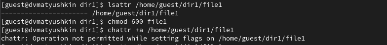
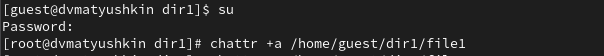
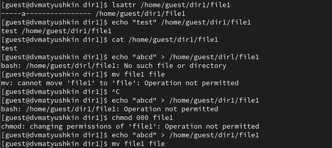
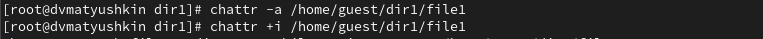
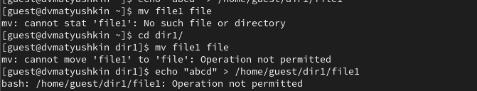

---
## Front matter
title: "Информационная безопасность"
subtitle: "Лабораторная работа №4"
author: "Матюшкин Денис Владимирович (НПИбд-02-21)"

## Generic otions
lang: ru-RU
toc-title: "Содержание"

## Bibliography
bibliography: bib/cite.bib
csl: pandoc/csl/gost-r-7-0-5-2008-numeric.csl

## Pdf output format
toc: true # Table of contents
toc-depth: 2
lof: true # List of figures
lot: true # List of tables
fontsize: 12pt
linestretch: 1.5
papersize: a4
documentclass: scrreprt
## I18n polyglossia
polyglossia-lang:
  name: russian
  options:
	- spelling=modern
	- babelshorthands=true
polyglossia-otherlangs:
  name: english
## I18n babel
babel-lang: russian
babel-otherlangs: english
## Fonts
mainfont: IBM Plex Serif
romanfont: IBM Plex Serif
sansfont: IBM Plex Sans
monofont: IBM Plex Mono
mathfont: STIX Two Math
mainfontoptions: Ligatures=Common,Ligatures=TeX,Scale=0.94
romanfontoptions: Ligatures=Common,Ligatures=TeX,Scale=0.94
sansfontoptions: Ligatures=Common,Ligatures=TeX,Scale=MatchLowercase,Scale=0.94
monofontoptions: Scale=MatchLowercase,Scale=0.94,FakeStretch=0.9
mathfontoptions:
## Biblatex
biblatex: true
biblio-style: "gost-numeric"
biblatexoptions:
  - parentracker=true
  - backend=biber
  - hyperref=auto
  - language=auto
  - autolang=other*
  - citestyle=gost-numeric
## Pandoc-crossref LaTeX customization
figureTitle: "Рис."
tableTitle: "Таблица"
listingTitle: "Листинг"
lofTitle: "Список иллюстраций"
lotTitle: "Список таблиц"
lolTitle: "Листинги"
## Misc options
indent: true
header-includes:
  - \usepackage{indentfirst}
  - \usepackage{float} # keep figures where there are in the text
  - \floatplacement{figure}{H} # keep figures where there are in the text
---

# Цель работы

Получение практических навыков работы в консоли с расширенными атрибутами файлов.

# Теоретическое введение

VirtualBox (Oracle VM VirtualBox) — программный продукт виртуализации для операционных систем Windows, Linux, FreeBSD, macOS, Solaris/OpenSolaris, ReactOS, DOS и других [@virtualbox-doc:documentation].

Rocky Linux — дистрибутив Linux, разработанный Rocky Enterprise Software Foundation. Предполагается, что это будет полный бинарно-совместимый выпуск, использующий исходный код операционной системы Red Hat Enterprise Linux (RHEL) [@rocky-doc:documentation].

# Ход работы

1. От имени пользователя guest определите расширенные атрибуты файла /home/guest/dir1/file1 командой (рис. [-@fig:001]).

2. Установите командой chmod 600 file1 на файл file1 права, разрешающие чтение и запись для владельца файла. (рис. [-@fig:001]).

3. Попробуйте установить на файл /home/guest/dir1/file1 расширенный атрибут a от имени пользователя guest (рис. [-@fig:001]).

{#fig:001 width=100%}

4. Зайдите на третью консоль с правами администратора либо повысьте свои права с помощью команды su. Попробуйте установить расширенный атрибут a на файл /home/guest/dir1/file1 от имени суперпользователя (рис. [-@fig:002]).

{#fig:002 width=100%}

5. От пользователя guest проверьте правильность установления атрибута (рис. [-@fig:003]).

6. Выполните дозапись в файл file1 слова «test», после этого выполните чтение файла file1 (рис. [-@fig:003]).

7. Попробуйте удалить файл file1 либо стереть имеющуюся в нём информацию, Попробуйте переименовать файл (рис. [-@fig:003]).

8. Попробуйте с помощью команды chmod 000 file1 установить на файл file1 права, например, запрещающие чтение и запись для владельца файла. Нам не удалось успешно выполнить указанные команды (рис. [-@fig:003]).

{#fig:003 width=100%}

9. Снимите расширенный атрибут a с файла /home/guest/dirl/file1 от
имени суперпользователя (рис. [-@fig:004]). Повторите операции, которые вам ранее не удавалось выполнить (рис. [-@fig:003]). Удалось выполнить команды.

{#fig:004 width=100%}

10. Повторите ваши действия по шагам, заменив атрибут «a» атрибутом «i». (рис. [-@fig:005]). Атрибут i делает файл неизменяемым, поэтому команды не выполняются.

{#fig:005 width=100%}

# Выводы

В ходе данной лабораторной работы мы получили практические навыки работы в консоли с расширенными атрибутами файлов.

# Список литературы{.unnumbered}

::: {#refs}
:::
