---
## Front matter
lang: ru-RU
title: Информационная безопасность
subtitle: Лабораторная работа №5
author:
  - Матюшкин Д. В.
institute:
  - Российский университет дружбы народов, Москва, Россия
date: 23 сентября 2024

## i18n babel
babel-lang: russian
babel-otherlangs: english

## Formatting pdf
toc: false
toc-title: Содержание
slide_level: 2
aspectratio: 169
section-titles: true
theme: metropolis
header-includes:
 - \metroset{progressbar=frametitle,sectionpage=progressbar,numbering=fraction}
 - '\makeatletter'
 - '\beamer@ignorenonframefalse'
 - '\makeatother'

## Pandoc-crossref LaTeX customization
figureTitle: "Рис."
---

# Информация

## Докладчик

:::::::::::::: {.columns align=center}
::: {.column width="70%"}

  * Матюшкин Денис Владимирович
  * студент 4-го курса
  * группа НПИбд-02-21
  * Российский университет дружбы народов
  * [1032212279@pfur.ru](mailto:1032212279@pfur.ru)
  * <https://stifell.github.io/ru/>

:::
::: {.column width="30%"}

:::
::::::::::::::

# Цель работы

- Изучение механизмов изменения идентификаторов, применения SetUID- и Sticky-битов. Получение практических навыков работы в консоли с дополнительными атрибутами. Рассмотрение работы механизма смены идентификатора процессов пользователей, а также влияние бита Sticky на запись и удаление файлов.

# Выполнение лабораторной работы

# Создание программы

## 1. Создайте программу simpleid.c

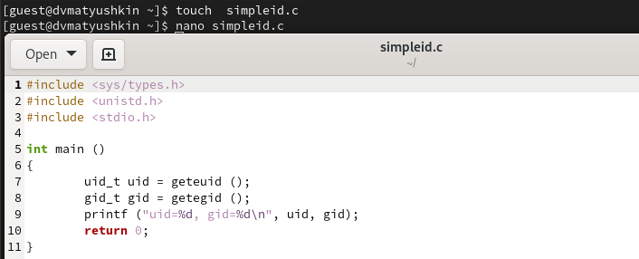{#fig:001 width=70%}

## 2. Скомплилируйте программу

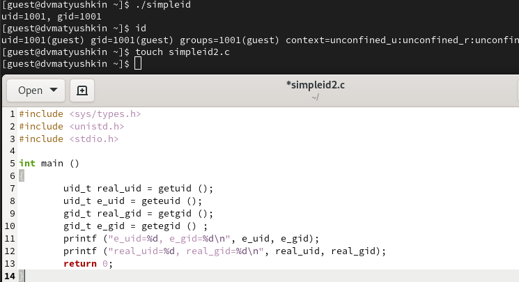{#fig:002 width=70%}

## 3. Скомпилируйте и запустите simpleid2.c

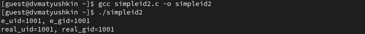{#fig:003 width=60%}

## 4. От имени суперпользователя выполните команды

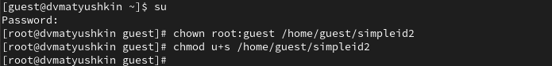{#fig:004 width=70%}

## 5. Выполните проверку правильности установки новых атрибутов

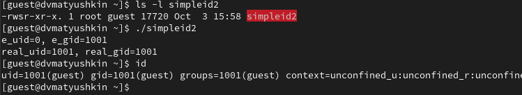{#fig:005 width=60%}

## 6.1. Проделайте тоже самое относительно SetGID-бита

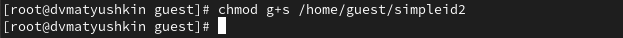{#fig:006 width=70%}

## 6.2. Продолжение

{#fig:007 width=70%}

## 7. Создайте программу readfile.c

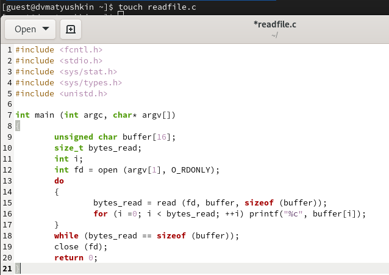{#fig:008 width=70%}

## 8. Смените владельца и права у файла readfile.c

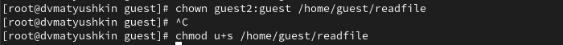{#fig:009 width=70%}

## 9. Проверьте, что пользователь guest не может прочитать файл readfile.c

{#fig:010 width=70%}

## 10. Выполнение команд

- Смените у программы readfile владельца и установите SetUID-бит (рис. [-@fig:009]).

- Проверьте, может ли программа readfile прочитать файл readfile.c (рис. [-@fig:010]).

- Проверьте, может ли программа readfile прочитать файл /etc/shadow (рис. [-@fig:010]).

# Исследование Sticky-бита

## 1.1. Работа в директории /tmp

- Выясните, установлен ли атрибут Sticky на директории /tmp (рис. [-@fig:011]).

- От имени пользователя guest создайте файл file01.txt (рис. [-@fig:011]).

- Просмотрите атрибуты у только что созданного файла и разрешите чтение и запись для категории пользователей «все остальные» (рис. [-@fig:011]).

## 1.2. Скриншот

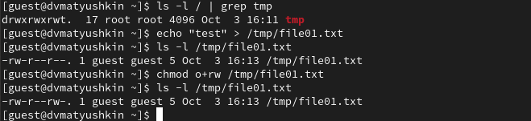{#fig:011 width=70%}

## 2.1. Работа с файлом file01.txt

- От пользователя guest2 попробуйте прочитать файл /tmp/file01.txt (рис. [-@fig:012]).

- От пользователя guest2 попробуйте дозаписать в файл /tmp/file01.txt слово test2 (рис. [-@fig:012]).

- Проверьте содержимое файла (рис. [-@fig:012]).

- От пользователя guest2 попробуйте записать в файл

- Проверьте содержимое файла

- От пользователя guest2 попробуйте удалить файл /tmp/file01.txt

## 2.2. Скриншот

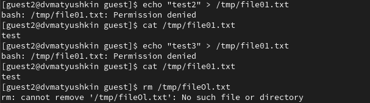{#fig:012 width=70%}

## 3. Повысьте свои права до суперпользователя и выполните после этого команду, снимающую атрибут t (Sticky-бит)

{#fig:013 width=70%}

## 4.1. Повторение действий с file01.txt

- От пользователя guest2 проверьте, что атрибута t у директории /tmp
нет (рис. [-@fig:013]).

- Повторите предыдущие шаги. Теперь можем все то же самое, но еще и удалять файл (рис. [-@fig:014]).

## 4.2. Скриншот

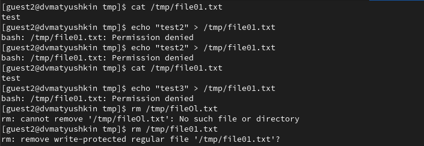{#fig:014 width=70%}

## 5.  Повысьте свои права до суперпользователя и верните атрибут t на директорию /tmp

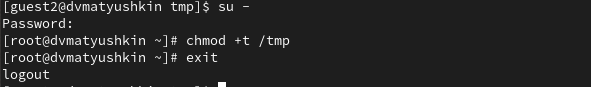{#fig:015 width=70%}

# Выводы

- В ходе данной лабораторной работы мы изучили механизм изменения идентификаторов, применение SetUID- и Sticky-битов. Получили практические навыки работы в консоли с дополнительными атрибутами. Рассмотрели работы механизма смены идентификатора процессов пользователей, а также влияние бита Sticky на запись и удаление файлов.