---
## Front matter
title: "Информационная безопасность"
subtitle: "Лабораторная работа №5"
author: "Матюшкин Денис Владимирович (НПИбд-02-21)"

## Generic otions
lang: ru-RU
toc-title: "Содержание"

## Bibliography
bibliography: bib/cite.bib
csl: pandoc/csl/gost-r-7-0-5-2008-numeric.csl

## Pdf output format
toc: true # Table of contents
toc-depth: 2
lof: true # List of figures
lot: true # List of tables
fontsize: 12pt
linestretch: 1.5
papersize: a4
documentclass: scrreprt
## I18n polyglossia
polyglossia-lang:
  name: russian
  options:
	- spelling=modern
	- babelshorthands=true
polyglossia-otherlangs:
  name: english
## I18n babel
babel-lang: russian
babel-otherlangs: english
## Fonts
mainfont: IBM Plex Serif
romanfont: IBM Plex Serif
sansfont: IBM Plex Sans
monofont: IBM Plex Mono
mathfont: STIX Two Math
mainfontoptions: Ligatures=Common,Ligatures=TeX,Scale=0.94
romanfontoptions: Ligatures=Common,Ligatures=TeX,Scale=0.94
sansfontoptions: Ligatures=Common,Ligatures=TeX,Scale=MatchLowercase,Scale=0.94
monofontoptions: Scale=MatchLowercase,Scale=0.94,FakeStretch=0.9
mathfontoptions:
## Biblatex
biblatex: true
biblio-style: "gost-numeric"
biblatexoptions:
  - parentracker=true
  - backend=biber
  - hyperref=auto
  - language=auto
  - autolang=other*
  - citestyle=gost-numeric
## Pandoc-crossref LaTeX customization
figureTitle: "Рис."
tableTitle: "Таблица"
listingTitle: "Листинг"
lofTitle: "Список иллюстраций"
lotTitle: "Список таблиц"
lolTitle: "Листинги"
## Misc options
indent: true
header-includes:
  - \usepackage{indentfirst}
  - \usepackage{float} # keep figures where there are in the text
  - \floatplacement{figure}{H} # keep figures where there are in the text
---

# Цель работы

Изучение механизмов изменения идентификаторов, применения SetUID- и Sticky-битов. Получение практических навыков работы в консоли с дополнительными атрибутами. Рассмотрение работы механизма смены идентификатора процессов пользователей, а также влияние бита Sticky на запись и удаление файлов.

# Теоретическое введение

VirtualBox (Oracle VM VirtualBox) — программный продукт виртуализации для операционных систем Windows, Linux, FreeBSD, macOS, Solaris/OpenSolaris, ReactOS, DOS и других [@virtualbox-doc:documentation].

Rocky Linux — дистрибутив Linux, разработанный Rocky Enterprise Software Foundation. Предполагается, что это будет полный бинарно-совместимый выпуск, использующий исходный код операционной системы Red Hat Enterprise Linux (RHEL) [@rocky-doc:documentation].

# Ход работы

## Создание программы

1. Войдите в систему от имени пользователя guest.

2. Создайте программу simpleid.c (рис. [-@fig:001]).

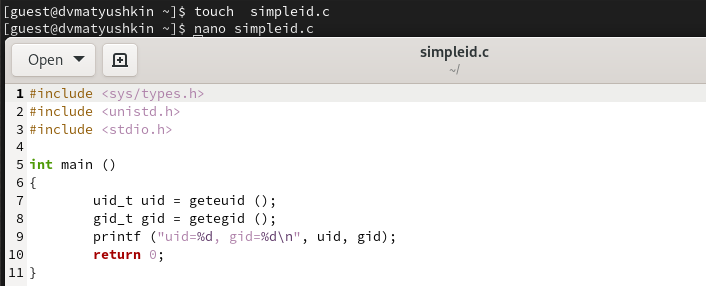{#fig:001 width=100%}

3. Скомплилируйте программу и убедитесь, что файл программы создан. Выполните программу simpleid и выполните системную программу id (рис. [-@fig:002]). Полученные результаты совпадают.

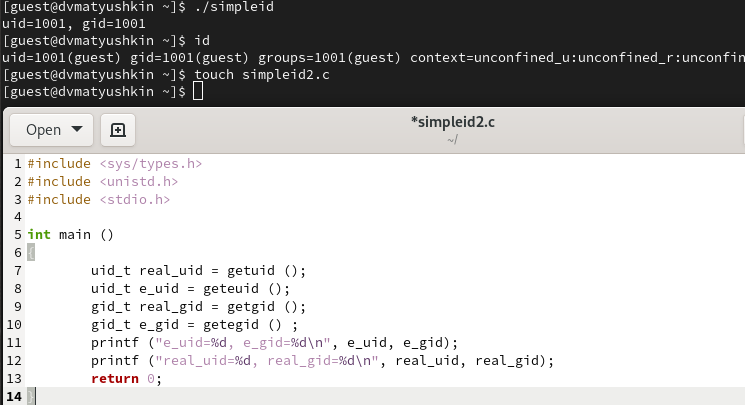{#fig:002 width=100%}

4. Усложните программу, добавив вывод действительных идентификаторов (рис. [-@fig:002]).

5. Скомпилируйте и запустите simpleid2.c (рис. [-@fig:003]).

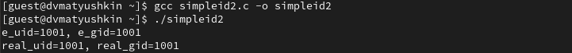{#fig:003 width=100%}

6. От имени суперпользователя выполните команды (рис. [-@fig:004]). Эти команды меняют владельца файла и устанавливают SetUID бит.

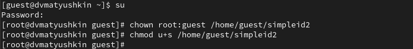{#fig:004 width=100%}

7. Выполните проверку правильности установки новых атрибутов и смены
владельца файла simpleid2. Запустите simpleid2 и id (рис. [-@fig:005]).

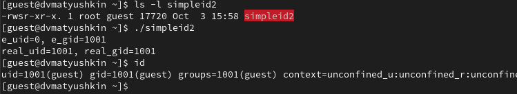{#fig:005 width=100%}

8. Проделайте тоже самое относительно SetGID-бита (рис. [-@fig:006] и [-@fig:007]).

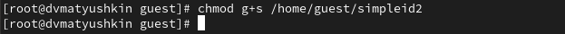{#fig:006 width=100%}

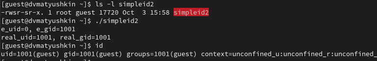{#fig:007 width=100%}

9. Создайте программу readfile.c. Откомпилируйте её (рис. [-@fig:008]).

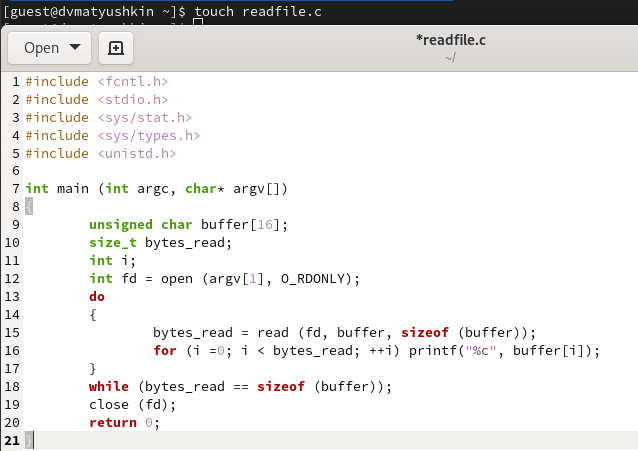{#fig:008 width=100%}

10. Смените владельца у файла readfile.c (или любого другого текстового
файла в системе) и измените права так, чтобы только суперпользователь
(root) мог прочитать его, a guest не мог (рис. [-@fig:009]).

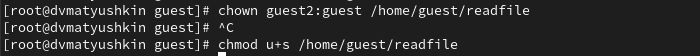{#fig:009 width=100%}

11. Проверьте, что пользователь guest не может прочитать файл readfile.c (рис. [-@fig:010]).

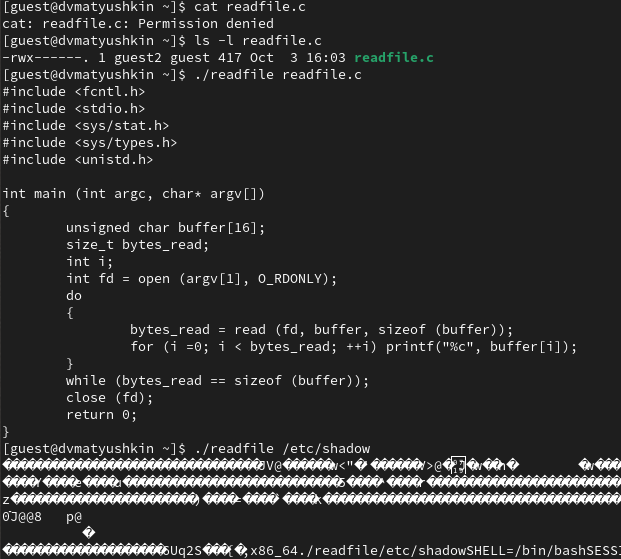{#fig:010 width=100%}

12. Смените у программы readfile владельца и установите SetUID-бит (рис. [-@fig:009]).

13. Проверьте, может ли программа readfile прочитать файл readfile.c (рис. [-@fig:010]).

14. Проверьте, может ли программа readfile прочитать файл /etc/shadow (рис. [-@fig:010]).

Команды выполняются, т.к. Setuid – это бит разрешения, который позволяет пользователю запускать исполняемый файл с правами владельца этого файла.

## Исследование Sticky-бита

1. Выясните, установлен ли атрибут Sticky на директории /tmp (рис. [-@fig:011]).

2. От имени пользователя guest создайте файл file01.txt в директории /tmp
со словом test (рис. [-@fig:011]).

3. Просмотрите атрибуты у только что созданного файла и разрешите чтение и запись для категории пользователей «все остальные» (рис. [-@fig:011]).

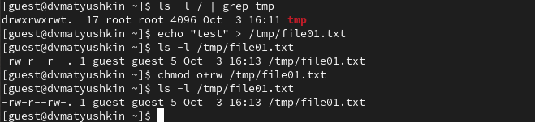{#fig:011 width=100%}

4. От пользователя guest2 (не являющегося владельцем) попробуйте прочитать файл /tmp/file01.txt (рис. [-@fig:012]).

5. От пользователя guest2 попробуйте дозаписать в файл /tmp/file01.txt слово test2 (рис. [-@fig:012]).

6. Проверьте содержимое файла командой (рис. [-@fig:012]).

7. От пользователя guest2 попробуйте записать в файл /tmp/file01.txt
слово test3, стерев при этом всю имеющуюся в файле информацию (рис. [-@fig:012]).

8. Проверьте содержимое файла командой (рис. [-@fig:012]).

9. От пользователя guest2 попробуйте удалить файл /tmp/file01.txt (рис. [-@fig:012]).

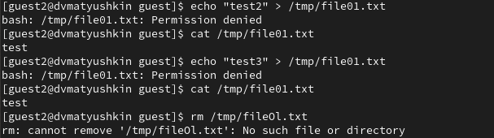{#fig:012 width=100%}

Удалить файл нам не получилось.

10. Повысьте свои права до суперпользователя и выполните после этого команду, снимающую атрибут t (Sticky-бит) с директории /tmp. После покиньте режим суперпользователя (рис. [-@fig:013]).

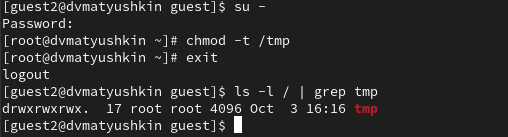{#fig:013 width=100%}

11. От пользователя guest2 проверьте, что атрибута t у директории /tmp
нет (рис. [-@fig:013]).

12. Повторите предыдущие шаги. Теперь можем все то же самое, но еще и удалять файл (рис. [-@fig:014]).

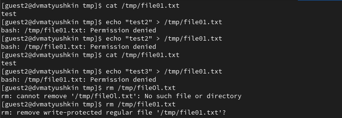{#fig:014 width=100%}

13. Повысьте свои права до суперпользователя и верните атрибут t на директорию /tmp (рис. [-@fig:015]).

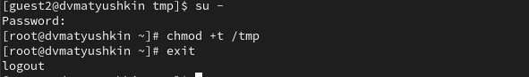{#fig:015 width=100%}

# Выводы

В ходе данной лабораторной работы мы изучили механизм изменения идентификаторов, применение SetUID- и Sticky-битов. Получили практические навыки работы в консоли с дополнительными атрибутами. Рассмотрели работы механизма смены идентификатора процессов пользователей, а также влияние бита Sticky на запись и удаление файлов.

# Список литературы{.unnumbered}

::: {#refs}
:::
