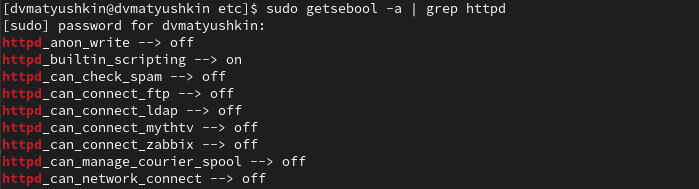
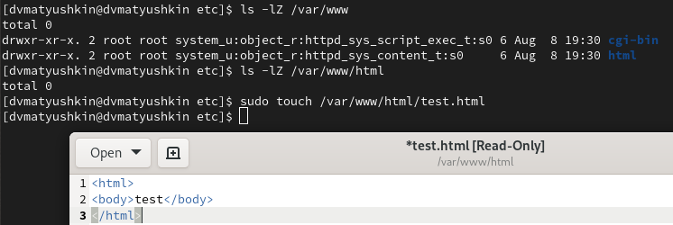
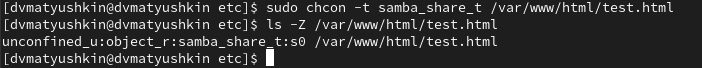
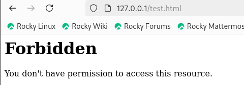
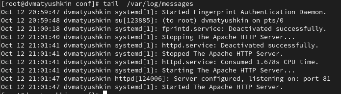
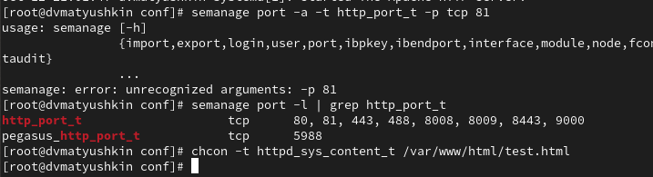

---
## Front matter
lang: ru-RU
title: Информационная безопасность
subtitle: Лабораторная работа №6
author:
  - Матюшкин Д. В.
institute:
  - Российский университет дружбы народов, Москва, Россия
date: 12 октября 2024

## i18n babel
babel-lang: russian
babel-otherlangs: english

## Formatting pdf
toc: false
toc-title: Содержание
slide_level: 2
aspectratio: 169
section-titles: true
theme: metropolis
header-includes:
 - \metroset{progressbar=frametitle,sectionpage=progressbar,numbering=fraction}
 - '\makeatletter'
 - '\beamer@ignorenonframefalse'
 - '\makeatother'

## Pandoc-crossref LaTeX customization
figureTitle: "Рис."
---

# Информация

## Докладчик

:::::::::::::: {.columns align=center}
::: {.column width="70%"}

  * Матюшкин Денис Владимирович
  * студент 4-го курса
  * группа НПИбд-02-21
  * Российский университет дружбы народов
  * [1032212279@pfur.ru](mailto:1032212279@pfur.ru)
  * <https://stifell.github.io/ru/>

:::
::: {.column width="30%"}

:::
::::::::::::::

# Цель работы

- Развить навыки администрирования ОС Linux. Получить первое практическое знакомство с технологией SELinux. Проверить работу SELinx на практике совместно с веб-сервером Apache.

# Выполнение лабораторной работы

## 1. Убедитесь, что SELinux работает в режиме enforcing политики targeted

{#fig:001 width=70%}

## 2. Запуск localhost

{#fig:002 width=70%}

## 3. Определите контекст безопасности Apache

{#fig:003 width=70%}

## 4. Посмотрите текущее состояние переключателей SELinux

{#fig:004 width=70%}

## 5. Посмотрите статистику по политике

{#fig:005 width=70%}

## 6.1. Выполнение нескольких задач

- Определите тип файлов и поддиректорий /var/www и /var/www/html

- Определите круг пользователей, которым разрешено создание файлов в
директории /var/www/html

- Создайте от имени суперпользователя html-файл /var/www/html/test.html

## 6.2. Скриншот

{#fig:006 width=70%}

## 7. Проверьте контекст созданного вами файла

{#fig:007 width=70%}

## 8. Обратитесь к файлу через веб-сервер

{#fig:008 width=70%}

## 9. Измените контекст файла /var/www/html/test.html

{#fig:009 width=70%}

## 10. Попробуйте ещё раз получить доступ к файлу через веб-сервер

{#fig:010 width=70%}

## 11. Проанализируйте ситуацию

{#fig:011 width=70%}

## 12. Попробуйте запустить веб-сервер Apache на прослушивание ТСР-порта 81

{#fig:012 width=70%}

## 13. Выполните перезапуск веб-сервера Apache

- Сбоя не произошло, потому что порт 81 уже был в списке портов.

## 14. Проанализируйте лог-файлы

{#fig:013 width=70%}

## 15. Выполните команду добавления порта

{#fig:014 width=70%}

## 16. Возвразещение настроек

- Верните контекст httpd_sys_cоntent__t к файлу /var/www/html/ test.html

- Исправьте обратно конфигурационный файл apache, вернув Listen 80

## 17. Удалите привязку и созданный ранее файл

{#fig:015 width=70%}

# Выводы

- В ходе данной лабораторной работы мы развили навыки администрирования ОС Linux. Получили первое практическое знакомство с технологией SELinux. Проверили работу SELinx на практике совместно с веб-сервером Apache.