---
## Front matter
title: "Информационная безопасность"
subtitle: "Лабораторная работа №6"
author: "Матюшкин Денис Владимирович (НПИбд-02-21)"

## Generic otions
lang: ru-RU
toc-title: "Содержание"

## Bibliography
bibliography: bib/cite.bib
csl: pandoc/csl/gost-r-7-0-5-2008-numeric.csl

## Pdf output format
toc: true # Table of contents
toc-depth: 2
lof: true # List of figures
lot: true # List of tables
fontsize: 12pt
linestretch: 1.5
papersize: a4
documentclass: scrreprt
## I18n polyglossia
polyglossia-lang:
  name: russian
  options:
	- spelling=modern
	- babelshorthands=true
polyglossia-otherlangs:
  name: english
## I18n babel
babel-lang: russian
babel-otherlangs: english
## Fonts
mainfont: IBM Plex Serif
romanfont: IBM Plex Serif
sansfont: IBM Plex Sans
monofont: IBM Plex Mono
mathfont: STIX Two Math
mainfontoptions: Ligatures=Common,Ligatures=TeX,Scale=0.94
romanfontoptions: Ligatures=Common,Ligatures=TeX,Scale=0.94
sansfontoptions: Ligatures=Common,Ligatures=TeX,Scale=MatchLowercase,Scale=0.94
monofontoptions: Scale=MatchLowercase,Scale=0.94,FakeStretch=0.9
mathfontoptions:
## Biblatex
biblatex: true
biblio-style: "gost-numeric"
biblatexoptions:
  - parentracker=true
  - backend=biber
  - hyperref=auto
  - language=auto
  - autolang=other*
  - citestyle=gost-numeric
## Pandoc-crossref LaTeX customization
figureTitle: "Рис."
tableTitle: "Таблица"
listingTitle: "Листинг"
lofTitle: "Список иллюстраций"
lotTitle: "Список таблиц"
lolTitle: "Листинги"
## Misc options
indent: true
header-includes:
  - \usepackage{indentfirst}
  - \usepackage{float} # keep figures where there are in the text
  - \floatplacement{figure}{H} # keep figures where there are in the text
---

# Цель работы

Развить навыки администрирования ОС Linux. Получить первое практическое знакомство с технологией SELinux. Проверить работу SELinx на практике совместно с веб-сервером Apache.

# Теоретическое введение

VirtualBox (Oracle VM VirtualBox) — программный продукт виртуализации для операционных систем Windows, Linux, FreeBSD, macOS, Solaris/OpenSolaris, ReactOS, DOS и других [@virtualbox-doc:documentation].

Rocky Linux — дистрибутив Linux, разработанный Rocky Enterprise Software Foundation. Предполагается, что это будет полный бинарно-совместимый выпуск, использующий исходный код операционной системы Red Hat Enterprise Linux (RHEL) [@rocky-doc:documentation].

# Ход работы

1. Войдите в систему с полученными учётными данными и убедитесь, что
SELinux работает в режиме enforcing политики targeted с помощью команд getenforce и sestatus (рис. [-@fig:001]).

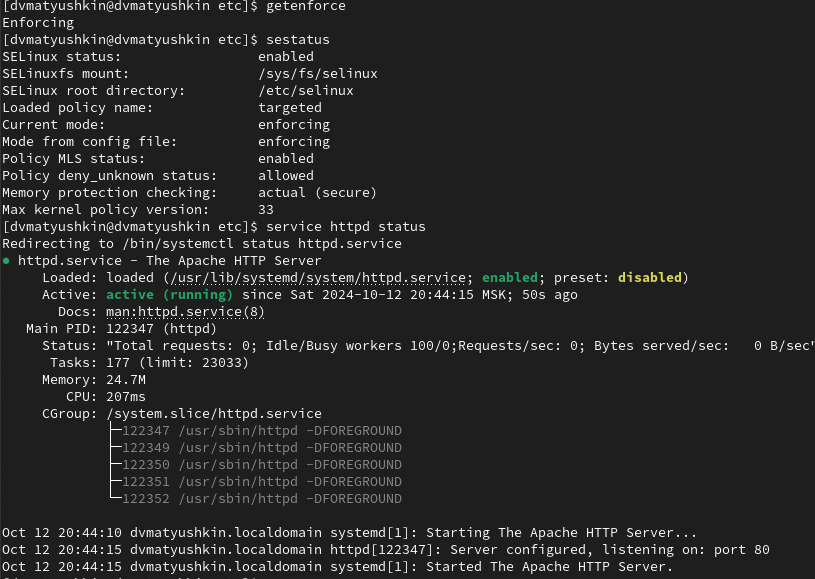{#fig:001 width=100%}

2. Обратитесь с помощью браузера к веб-серверу, запущенному на вашем
компьютере, и убедитесь, что последний работает (рис. [-@fig:002]).

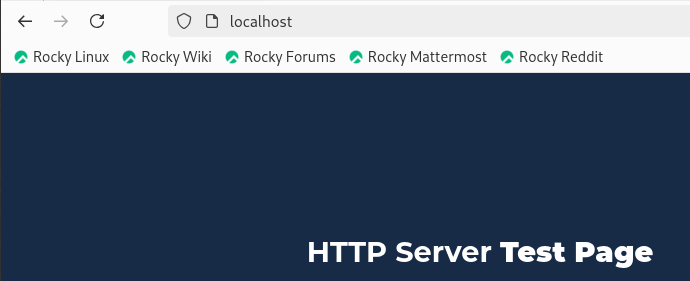{#fig:002 width=100%}

3. Найдите веб-сервер Apache в списке процессов, определите его контекст
безопасности и занесите эту информацию в отчёт (рис. [-@fig:003]).

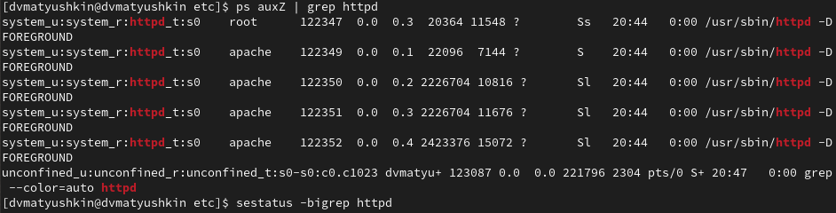{#fig:003 width=100%}

4. Посмотрите текущее состояние переключателей SELinux для Apache (рис. [-@fig:004]).

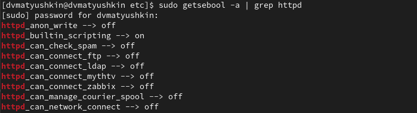{#fig:004 width=100%}

5. Посмотрите статистику по политике с помощью команды seinfo, также
определите множество пользователей, ролей, типов (рис. [-@fig:005]).

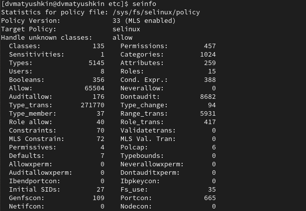{#fig:005 width=100%}

6. Определите тип файлов и поддиректорий, находящихся в директории
/var/www (рис. [-@fig:006]).

7. Определите тип файлов, находящихся в директории /var/www/html (рис. [-@fig:006]).

8. Определите круг пользователей, которым разрешено создание файлов в
директории /var/www/html (рис. [-@fig:006]).

9. Создайте от имени суперпользователя (так как в дистрибутиве после установки только ему разрешена запись в директорию) html-файл
/var/www/html/test.html (рис. [-@fig:006]).

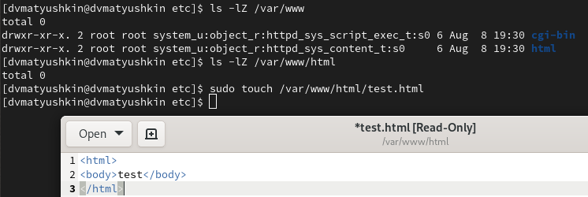{#fig:006 width=100%}

10. Проверьте контекст созданного вами файла. Занесите в отчёт контекст,
присваиваемый по умолчанию вновь созданным файлам в директории
/var/www/html (рис. [-@fig:007]).

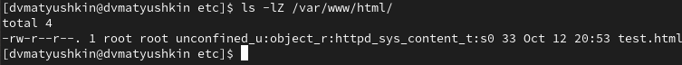{#fig:007 width=100%}

11. Обратитесь к файлу через веб-сервер, введя в браузере адрес
http://127.0.0.1/test.html. Убедитесь, что файл был успешно отображён (рис. [-@fig:008]).

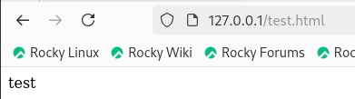{#fig:008 width=100%}

12. Изучите справку man httpd_selinux и выясните, какие контексты файлов определены для httpd. Сопоставьте их с типом файла
test.html. Проверить контекст файла можно командой ls -Z.

13. Измените контекст файла /var/www/html/test.html с
httpd_sys_content_t на любой другой, к которому процесс httpd не
должен иметь доступа, например, на samba_share_t (рис. [-@fig:009]).

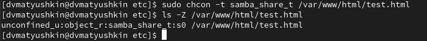{#fig:009 width=100%}

14. Попробуйте ещё раз получить доступ к файлу через веб-сервер, введя в
браузере адрес http://127.0.0.1/test.html. Вы должны получить
сообщение об ошибке (рис. [-@fig:010]).

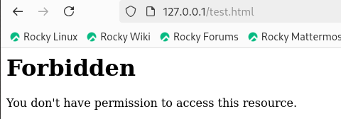{#fig:010 width=100%}

15. Проанализируйте ситуацию. Почему файл не был отображён, если права
доступа позволяют читать этот файл любому пользователю?
Просмотрите log-файлы веб-сервера Apache. Также просмотрите системный лог-файл:
tail /var/log/messages (рис. [-@fig:011]).

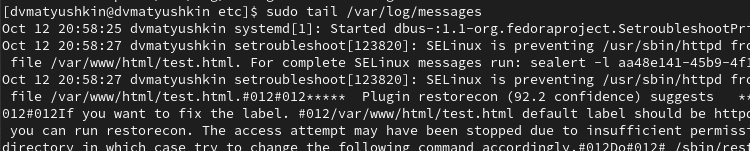{#fig:011 width=100%}

16. Попробуйте запустить веб-сервер Apache на прослушивание ТСР-порта
81 (а не 80, как рекомендует IANA и прописано в /etc/services). Для
этого в файле /etc/httpd/httpd.conf найдите строчку Listen 80 и
замените её на Listen 81 (рис. [-@fig:012]).

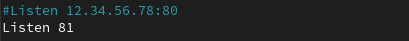{#fig:012 width=100%}

17. Выполните перезапуск веб-сервера Apache. Произошёл сбой? Поясните
почему?

Сбоя не произошло, потому что порт 81 уже был в списке портов.

18. Проанализируйте лог-файлы:
tail -nl /var/log/messages (рис. [-@fig:013]).

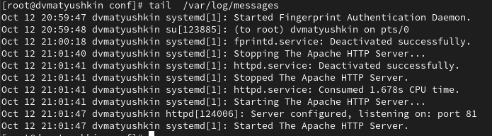{#fig:013 width=100%}

19. Выполните команду
semanage port -a -t http_port_t -р tcp 81
После этого проверьте список портов командой
semanage port -l | grep http_port_t
Убедитесь, что порт 81 появился в списке (рис. [-@fig:014]).

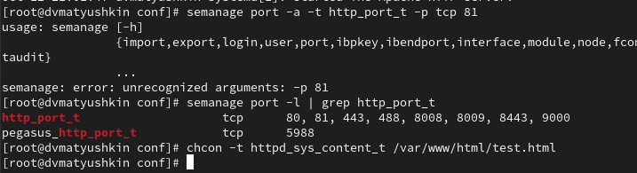{#fig:014 width=100%}

Порт уже был добавлен.

20. Попробуйте запустить веб-сервер Apache ещё раз. Поняли ли вы, почему
он сейчас запустился, а в предыдущем случае не смог?

И в прошлый раз мог.

21. Верните контекст httpd_sys_cоntent__t к файлу /var/www/html/ test.html. После этого попробуйте получить доступ к файлу через веб-сервер, введя в браузере адрес http://127.0.0.1:81/test.html.
Вы должны увидеть содержимое файла — слово «test».

22. Исправьте обратно конфигурационный файл apache, вернув Listen 80.

23. Удалите привязку http_port_t к 81 порту (рис. [-@fig:015]).

24. Удалите файл /var/www/html/test.html (рис. [-@fig:015]).

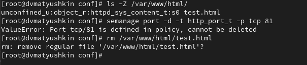{#fig:015 width=100%}

# Выводы

В ходе данной лабораторной работы мы развили навыки администрирования ОС Linux. Получили первое практическое знакомство с технологией SELinux. Проверили работу SELinx на практике совместно с веб-сервером Apache.

# Список литературы{.unnumbered}

::: {#refs}
:::
