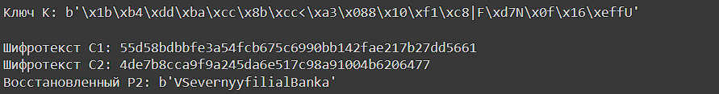

---
## Front matter
lang: ru-RU
title: Информационная безопасность
subtitle: Лабораторная работа №8
author:
  - Матюшкин Д. В.
institute:
  - Российский университет дружбы народов, Москва, Россия
date: 25 октября 2024

## i18n babel
babel-lang: russian
babel-otherlangs: english

## Formatting pdf
toc: false
toc-title: Содержание
slide_level: 2
aspectratio: 169
section-titles: true
theme: metropolis
header-includes:
 - \metroset{progressbar=frametitle,sectionpage=progressbar,numbering=fraction}
 - '\makeatletter'
 - '\beamer@ignorenonframefalse'
 - '\makeatother'

## Pandoc-crossref LaTeX customization
figureTitle: "Рис."
---

# Информация

## Докладчик

:::::::::::::: {.columns align=center}
::: {.column width="70%"}

  * Матюшкин Денис Владимирович
  * студент 4-го курса
  * группа НПИбд-02-21
  * Российский университет дружбы народов
  * [1032212279@pfur.ru](mailto:1032212279@pfur.ru)
  * <https://stifell.github.io/ru/>

:::
::: {.column width="30%"}


:::
::::::::::::::

# Цель работы

- Освоить на практике применение режима однократного гаммирования
на примере кодирования различных исходных текстов одним ключом.

# Задача

Два текста кодируются одним ключом (однократное гаммирование).
Требуется не зная ключа и не стремясь его определить, прочитать оба текста. Необходимо разработать приложение, позволяющее шифровать и дешифровать тексты P1 и P2 в режиме однократного гаммирования. Приложение должно определить вид шифротекстов C1 и C2 обоих текстов P1 и
P2 при известном ключе ; Необходимо определить и выразить аналитически способ, при котором злоумышленник может прочитать оба текста, не
зная ключа и не стремясь его определить.

# Программа

## Программа на языке Python

```python
import secrets

def generate_random_key(length):
    return secrets.token_bytes(length)

def xor_operation(text, key):
    return bytes([t ^ k for t, k in zip(text, key)])

def encrypt(text, key):
    return xor_operation(text, key)

def decrypt_unknown_key(c1, c2, known_plaintext):
    return xor_operation(xor_operation(c1, c2), known_plaintext)
```

## Продолжение кода

```python
P1 = b"NaVashishodyashiyot1204"
P2 = b"VSevernyyfilialBanka"
key_length = max(len(P1), len(P2))
K = generate_random_key(key_length)
C1 = encrypt(P1, K)
C2 = encrypt(P2, K)
recovered_P2 = decrypt_unknown_key(C1, C2, P1)

print(f'Ключ K: {K}\n')
print(f'Шифротекст C1: {C1.hex()}')
print(f'Шифротекст C2: {C2.hex()}')
print(f'Восстановленный P2: {recovered_P2}')
```

## Вывод программы

{#fig:001 width=100%}


# Выводы

- В ходе данной лабораторной работы мы освоили на практике применение режима однократного гаммирования на примере кодирования различных исходных текстов одним ключом.
