---
## Front matter
lang: ru-RU
title: Информационная безопасность
subtitle: Индидивуальный проект №1
author:
  - Матюшкин Д. В.
institute:
  - Российский университет дружбы народов, Москва, Россия
date: 09 сентября 2024

## i18n babel
babel-lang: russian
babel-otherlangs: english

## Formatting pdf
toc: false
toc-title: Содержание
slide_level: 2
aspectratio: 169
section-titles: true
theme: metropolis
header-includes:
 - \metroset{progressbar=frametitle,sectionpage=progressbar,numbering=fraction}
 - '\makeatletter'
 - '\beamer@ignorenonframefalse'
 - '\makeatother'

## Pandoc-crossref LaTeX customization
figureTitle: "Рис."
---

# Информация

## Докладчик

:::::::::::::: {.columns align=center}
::: {.column width="70%"}

  * Матюшкин Денис Владимирович
  * студент 4-го курса
  * группа НПИбд-02-21
  * Российский университет дружбы народов
  * [1032212279@pfur.ru](mailto:1032212279@pfur.ru)
  * <https://stifell.github.io/ru/>

:::
::: {.column width="30%"}

:::
::::::::::::::

# Цель работы

- Целью данной работы является приобретение практических навыков установки операционной системы Kali Linux на виртуальную машину, настройки минимально необходимых для дальнейшей работы сервисов.

# Выполнение лабораторной работы

## 1. Начало создания виртуальной машины

Создайте новую виртуальную машину. Укажите имя виртуальной машины, тип операционной системы — Linux, Kali (рис. [-@fig:001]).

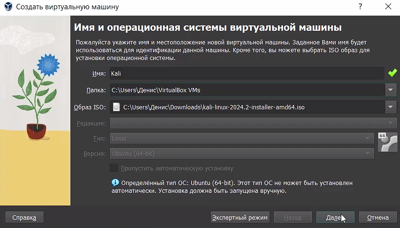{#fig:001 width=70%}

## 2. Размер основной памяти

Укажите размер основной памяти виртуальной машины — 4096 МБ и количество виртуальных процессоро (рис. [-@fig:002]).

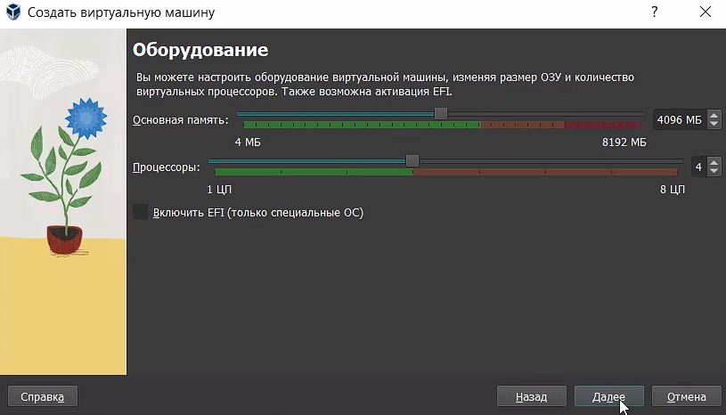{#fig:002 width=70%}

## 3. Размер диска

Задайте размер диска — 40 ГБ (или больше) (рис. [-@fig:003]).

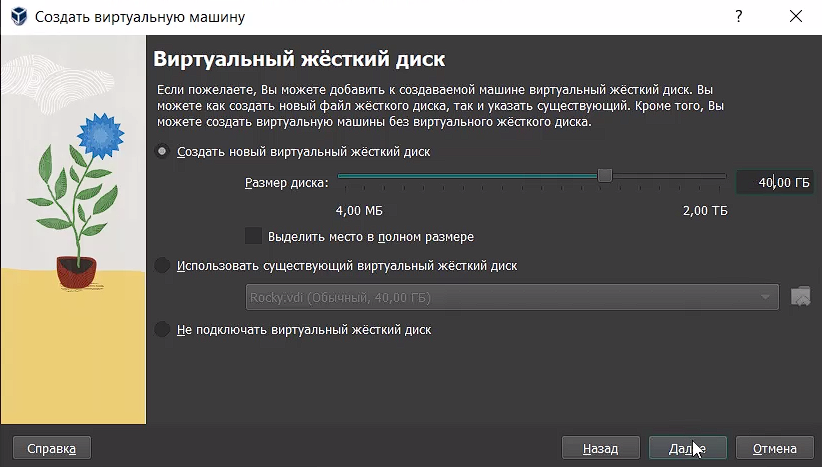{#fig:003 width=70%}

## 4. Создание

Создайте виртуальную машину (рис. [-@fig:004]).

{#fig:004 width=70%}

## 5. Первый запуск

Запустите виртуальную машину, выберите English в качестве языка интерфейса (рис. [-@fig:005]).

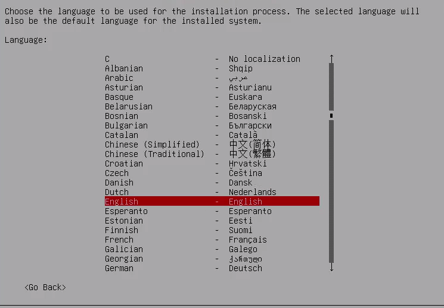{#fig:005 width=50%}

## 6. Выберите местоположение

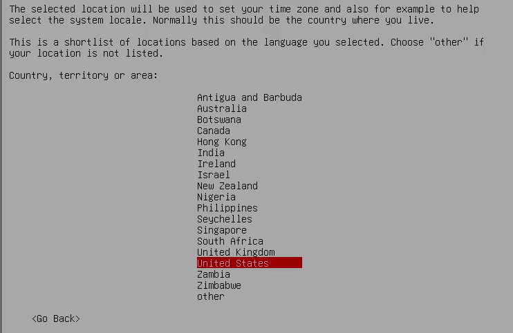{#fig:006 width=70%}

## 7. Имя узла

Включите сетевое соединение и в качестве имени узла укажите user.localdomain, где вместо user укажите имя своего пользователя в соответствии с соглашением об именовании (рис. [-@fig:007]).

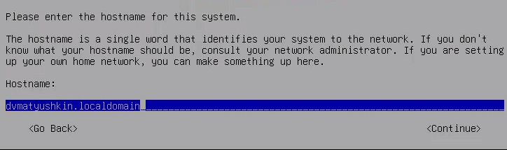{#fig:007 width=70%}

## 8. Создание пользователя

Задайте имя пользователя и пароль (рис. [-@fig:008] и [-@fig:009]).

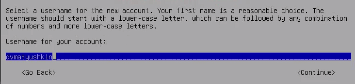{#fig:008 width=70%}

## 8.1 Продолжение

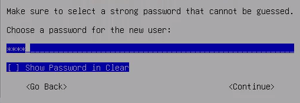{#fig:009 width=100%}

## 9. Часовой пояс

Выберите часовой пояс (рис. [-@fig:010]).

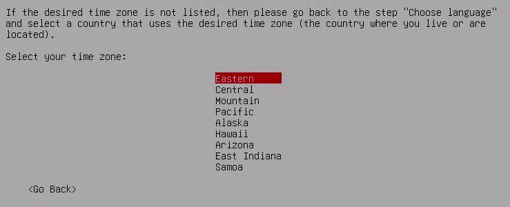{#fig:010 width=70%}

## 10. Разбиение ЖД

Выберите способ разбиения жесткого диска (рис. [-@fig:011]).

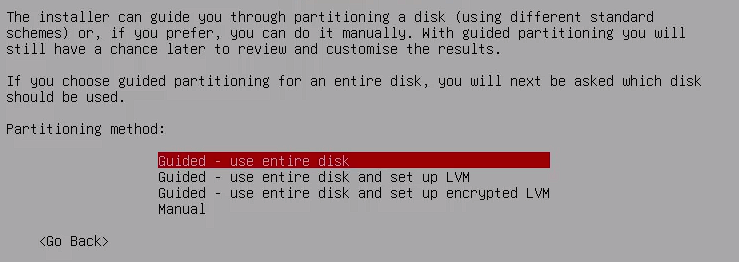{#fig:011 width=70%}

## 11. Схема разбияения

Выберите схему разбиения. По умолчанию выбран вариант Все файлы в одном разделе (рис. [-@fig:012]).

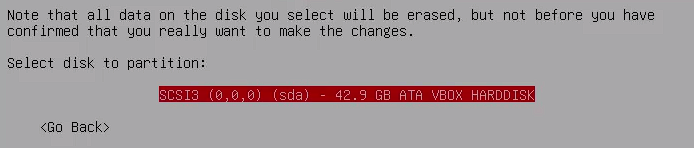{#fig:012 width=70%}

## 12. Загрузка

Начните загрузку компонентов (рис. [-@fig:013]).

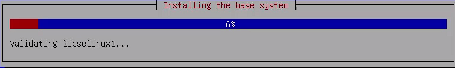{#fig:013 width=70%}

## 13. Вход и подключение образа

Войдите в ОС под заданной вами при установке учётной записью. В меню Устройства виртуальной машины подключите образ диска дополнений гостевой ОС (рис. [-@fig:014] и [-@fig:015]).

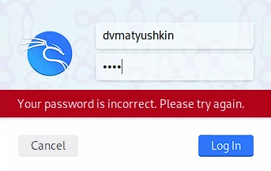{#fig:014 width=50%}

## 13.1 Продолжение

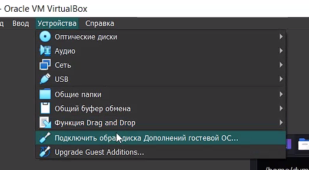{#fig:015 width=70%}

# Выводы

В ходе данной лабораторной работы мы приобрели практические навыки установки операционной системы Kali Linux на виртуальную машину, настроили минимально необходимые для дальнейшей работы сервисы.