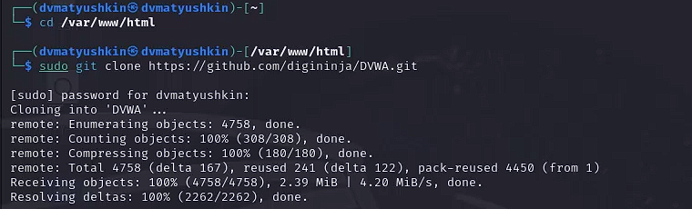
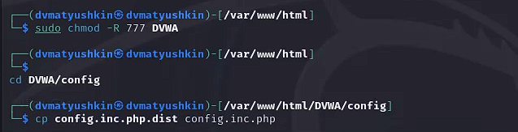
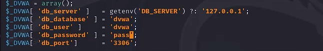
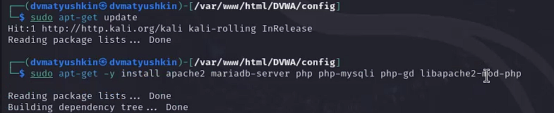
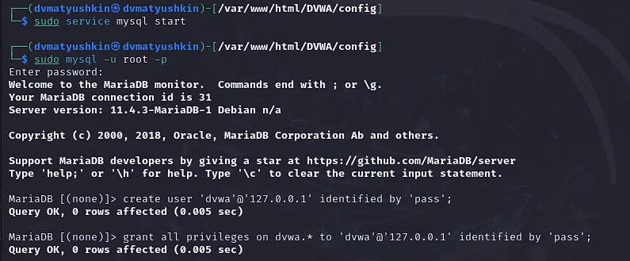
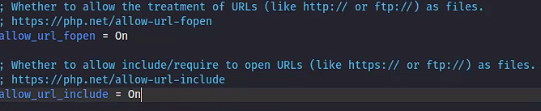
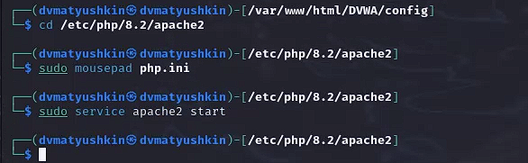
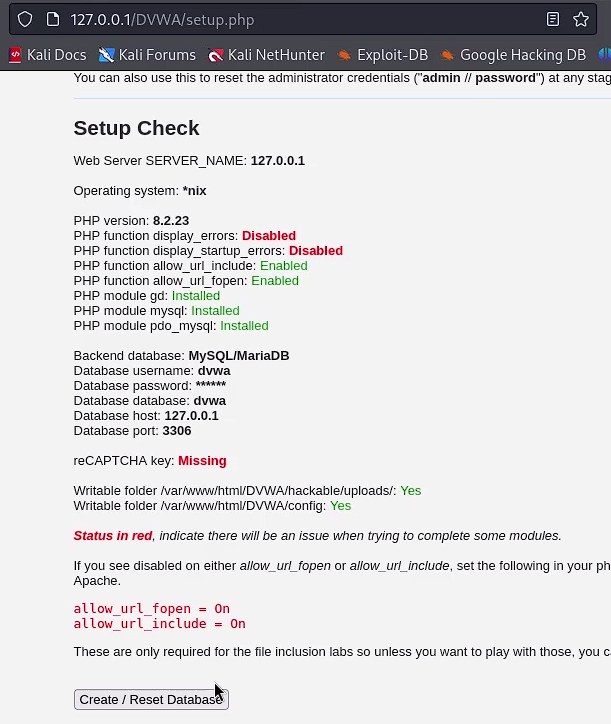
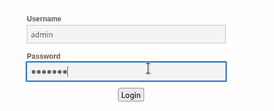

---
## Front matter
lang: ru-RU
title: Информационная безопасность
subtitle: Индидивуальный проект №2
author:
  - Матюшкин Д. В.
institute:
  - Российский университет дружбы народов, Москва, Россия
date: 19 сентября 2024

## i18n babel
babel-lang: russian
babel-otherlangs: english

## Formatting pdf
toc: false
toc-title: Содержание
slide_level: 2
aspectratio: 169
section-titles: true
theme: metropolis
header-includes:
 - \metroset{progressbar=frametitle,sectionpage=progressbar,numbering=fraction}
 - '\makeatletter'
 - '\beamer@ignorenonframefalse'
 - '\makeatother'

## Pandoc-crossref LaTeX customization
figureTitle: "Рис."
---

# Информация

## Докладчик

:::::::::::::: {.columns align=center}
::: {.column width="70%"}

  * Матюшкин Денис Владимирович
  * студент 4-го курса
  * группа НПИбд-02-21
  * Российский университет дружбы народов
  * [1032212279@pfur.ru](mailto:1032212279@pfur.ru)
  * <https://stifell.github.io/ru/>

:::
::: {.column width="30%"}

:::
::::::::::::::

# Цель работы

- Целью данной работы является установка DVWA в гостевую систему к Kali Linux.

# Выполнение лабораторной работы

## 1. Клонирование репозитория

{#fig:001 width=70%}

## 2. Работа с правами доступа и клонирование файла

{#fig:002 width=70%}

## 3. Замена пароля

{#fig:003 width=70%}

## 4. Установка mariadb

{#fig:004 width=70%}

## 5. Создание нового пользователя mariadb

{#fig:005 width=70%}

## 6. Включение параметров

{#fig:006 width=70%}

## 7. Запуск утилиты

{#fig:007 width=70%}

## 8. Запуск dvwa и создание базы данных

{#fig:008 width=50%}

## 9 Вход в учетную запись

{#fig:009 width=70%}

# Выводы

В ходе данной лабораторной работы мы установили DVWA в гостевую систему к Kali Linux.